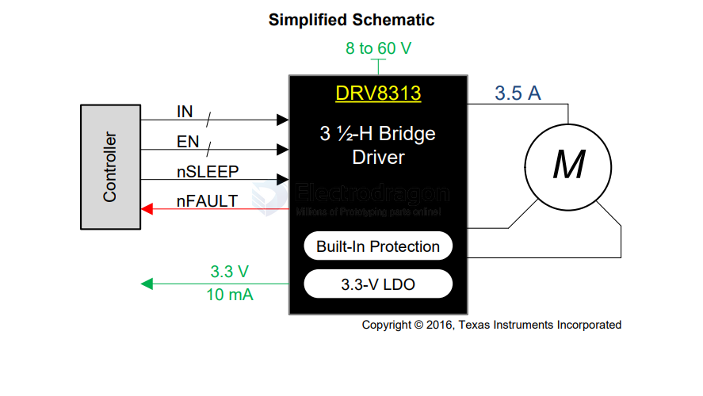

# DRV8313-dat

- DRV8313 - [DRV8313 2.5-A Triple 1/2-H Bridge Driver](https://www.ti.com/lit/ds/symlink/drv8313.pdf?ts=1735449878292&ref_url=https%253A%252F%252Fwww.google.com%252F)

Triple 1/2-H Bridge Driver IC
- 3-Phase brushless DC Motors
- Solenoid and Brushed DC Motors

## ref 

- [[motor-driver-dat]]