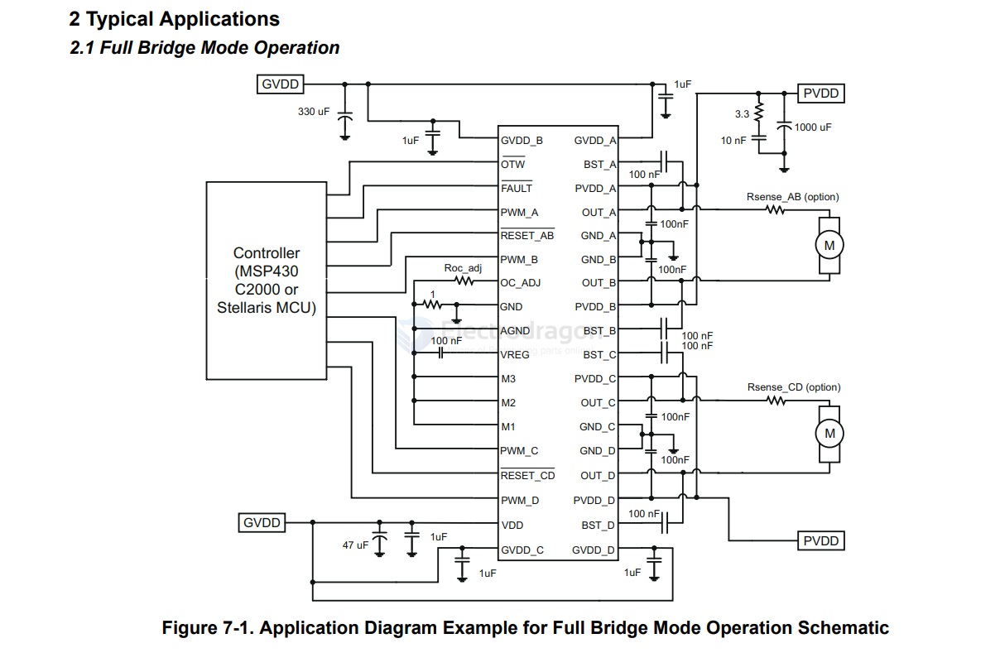

# DRV84x2-dat

1 Features

- • High-efficiency power stage (up to 97%) with low RDS(on) MOSFETs (110mΩ at TJ  = 25°C)
- • Operating supply voltage up to 52V
- • DRV8412 (Power pad down): up to 2 × 3A continuous output current (2 × 6A peak) in dual full-bridge mode or 6A continuous current in parallel mode (12A peak)
- • DRV8432 (Power pad up): up to 2 × 7A continuous output current (2 × 12A peak) in dual full-bridge mode or 14A continuous current in parallel mode (24A peak)
- • PWM operating frequency up to 500kHz
- • Integrated self-protection circuits including undervoltage, overtemperature, overload, and short circuit
- • Programmable cycle-by-cycle current limit protection
- • Independent supply and ground pins for each half bridge
- • Intelligent gate drive and cross conduction prevention
- • No external snubber or schottky diode is required

