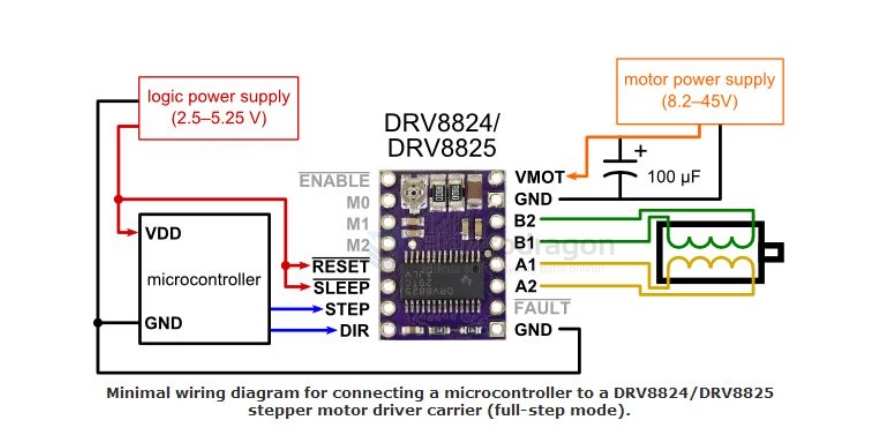

# DRV8825-dat

- [[SDR1042-dat]] [[A4988-dat]] - [[DRV8825-dat]] - [[SDR1040-dat]] - [[motor-driver-stepper-dat]]

## Info 
 
The DRV8825 is a stepper motor driver IC from Texas Instruments. It features microstepping capabilities, overcurrent protection, and thermal shutdown. It's commonly used in 3D printers, CNC machines, and other applications requiring precise motor control.
 
## App. 

- [[reprap-dat]] - [[3d-printer-dat]]
 
https://reprap.org/wiki/Pololu_stepper_driver_board#DRV8825

DRV8825相对4988 特点优势：

1、电流2.5A。

2、支持32细分。 

3、4层PCB板，散热性能更好。

4、芯片内阻更小，发热更低，散热性更好。

参数：

尺寸：1.5mmX2mm（和4988相同）

可驱动电流：2.5A

细分：1，1/2，1/4，1/8，1/16，1/32

制造工艺：SMT贴片机制造，非手工焊接，良品率更高，性能更稳定

适合对象：

需要驱动步进电机的场合。

是构建3d打印机，cnc，雕刻机等模块。

支持的3d打印机有Prusa Mendel,ultimaker,printbot,makerbot等。

1、适合驱动8.2V~45V 2.5A以下的步进电机；

2、只有简单的步进和方向控制接口；

3、六个不同的步进模式：全、半、1/4、1/8、1/16、1/32；

4、可调电位器可以调节电流输出，从而获得更高的步进率；

5、自动电流衰减模式检测/选择；

6、过热关闭电路、欠压锁定、交叉电流保护；

7、接地短路保护和加载短路保护

## wiring 

## ref 
 
- [[DRV8825]] 
 