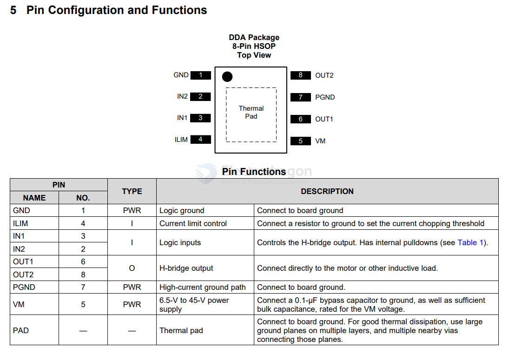
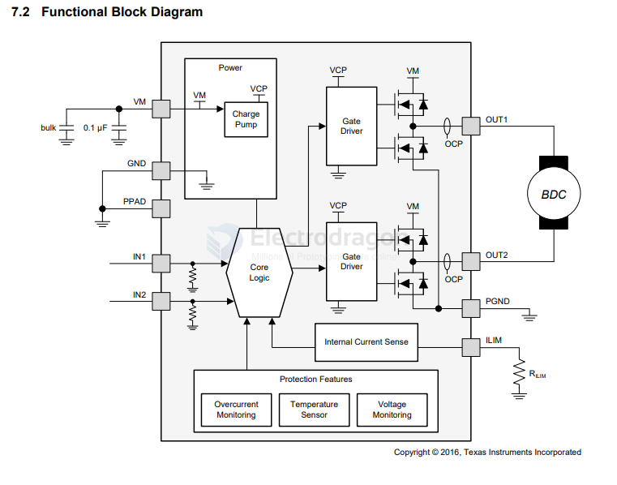
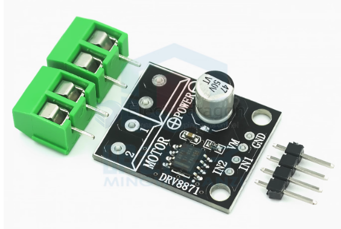

# DRV8871-dat

https://www.ti.com/lit/ds/symlink/drv8871.pdf?ts=1747938993424&ref_url=https%253A%252F%252Fwww.google.com.hk%252F

## APPs 

## ✅ Can I Use DRV8871 to Drive a Gear DC Motor?

Yes, you **can use the DRV8871 to drive a gear DC motor**, and it's actually **a good choice** in many applications.

---

### ✅ Why DRV8871 Is Suitable for Gear DC Motors

| Feature                  | Description                                                                 |
|--------------------------|-----------------------------------------------------------------------------|
| **Voltage Range**        | 6.5V to 45V — supports most DC gear motors                                  |
| **Current Capability**   | 3.6A continuous, 6A peak — suitable for medium-to-high torque gear motors    |
| **PWM Control**          | Supports PWM input — lets you control speed effectively                     |
| **Built-in Protection**  | Overcurrent, undervoltage, thermal shutdown, and shoot-through protection   |
| **Brushed DC Motor**     | Designed for brushed DC motors, which includes most gear motors             |

---

### ⚠️ Things to Check Before Using

1. **Motor Voltage**: Must be within 6.5V–45V.
2. **Motor Current**: Peak current should not exceed 6A.
3. **Heatsinking**: May be required for high current loads to prevent overheating.

---

### 🛠 Example Use Case

- A **12V gear motor** drawing **1–2A average** and **<6A peak** is **ideal** for DRV8871.
- Great for applications like:
  - Robot arms
  - Mobile platforms
  - Mechanisms with high starting torque

## board 

- ILIM == pin4 == Connect a resistor to ground to set the current chopping threshold

For example, if R_ILIM = 32 kΩ, the DRV8871 device limits motor current to 2 A no matter how much load torque is applied. 

The minimum allowed RILIM is 15 kΩ.

## ref 

- [[DRV8871-dat]]