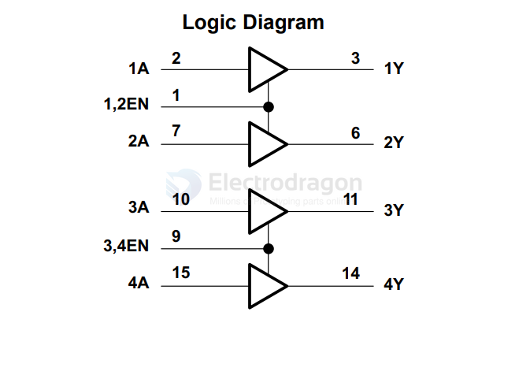

# L293-dat

## Info 
 
chip info, [datasheet](https://www.ti.com/lit/ds/symlink/l293.pdf), etc.

The L293D is a 16-pin motor driver IC, also known as a quad half-H driver, capable of controlling two DC motors or a single stepper motor, offering bidirectional drive currents of up to 600mA per channel at voltages from 4.5V to 36V. 

## App. 

- [[SDR1064-dat]]

## demo code 

- single DC motor control [[afMotor-1.ino]]

## ref 
 
- [[74LVC2G04-dat]] - [[logic-inverter-dat]] - [[logic-gate-dat]]

- [[L293]] 
 

