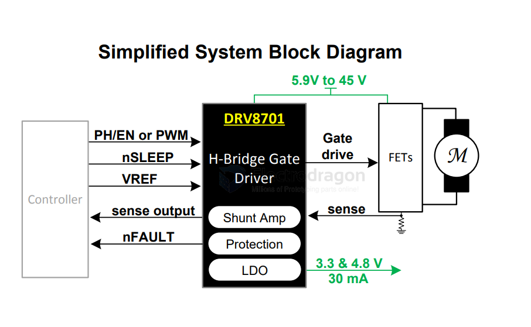

# TI-Motor-dat

- [[DRV8313-dat]]

- [[DRV8837-dat]] - [[DRV8848-dat]]

- [[DRV8833-dat]] - [[DRV8834-dat]]

- [[DRV8825-dat]] / [[DRV8835-dat]] 

- [[DRV8870-dat]] - [[DRV8871-dat]] / [[DRV8872-dat]]

- [[ULN2003-dat]]

DRV8701 Brushed DC Motor Full-Bridge Gate Driver

Features
-  Single H-Bridge Gate Driver
-  Drives Four External N-Channel MOSFETs
-  Supports 100% PWM Duty Cycle
-  5.9-V to 45-V Operating Supply Voltage Range Two Control Interface Options
- PH/EN (DRV8701E)
- PWM (DRV8701P)
- Adjustable Gate Drive (5 Levels) 6-mA to 150-mA Source Current
- 12.5-mA to 300-mA Sink Current
- Supports 1.8-V, 3.3-V, and 5-V Logic Inputs
-  Current Shunt Amplifier (20 V/V)
- Integrated PWM Current Regulation
- Limits Motor Inrush CurrentLow-Power Sleep Mode (9 μA)
- Two LDO Voltage Regulators to Power External
- Components
-  AVDD: 4.8 V, up to 30-mA Output Load
-  DVDD: 3.3 V, up to 30-mA Output Load
-  Small Package and Footprint  24-Pin VQFN (PowerPADTM)
- 4.0 x 4.0 x 0.9 mm
- Protection Features:
- VM Undervoltage Lockout (UVLO)
- Charge Pump Undervoltage (CPUV)
-  Overcurrent Protection (OCP)
- Pre-Driver Fault (PDF)
- Thermal Shutdown (TSD)
- Fault Condition Output (nFAULT)

Motor/Load Current (System Dependent)

Because the DRV8701 uses external MOSFETs, the maximum current can pull is limited only by the MOSFETs you choose and your PCB's thermal design.

* **DRV8701 Evaluation Module (EVM):** Rated for **15A continuous** and **20A peak**.
* **Theoretical Limit:** With high-performance MOSFETs and heavy copper traces (e.g., 2oz or 3oz copper), users have successfully pushed this driver to handle **30A to 50A+** continuous loads.

## compare 

| Chip    | Motor Type           | Voltage Range (V) | Continuous Current (A) | Peak Current (A)  | RDS(on) (mΩ) | Control Interface | Features                                                                |
| ------- | -------------------- | ----------------- | ---------------------- | ----------------- | ------------ | ----------------- | ----------------------------------------------------------------------- |
| DRV8313 | 3-Phase BLDC         | 8 – 60            | 2.5                    | —                 | —            | PWM               | Triple half-bridge, integrated FETs, supports BLDC motors               |
| DRV8837 | Brushed DC           | 1.8 – 11          | 1                      | 1.8               | 280          | PWM               | Single H-bridge, low voltage, compact design                            |
| DRV8848 | Brushed DC / Stepper | 4 – 18            | 2 (per H-bridge)       | 4 (parallel mode) | 900          | PWM               | Dual H-bridge, supports stepper and DC motors, parallel mode capability |
| DRV8833 | Brushed DC / Stepper | 2.7 – 10.8        | 1.5 (per H-bridge)     | 2                 | 360          | PWM               | Dual H-bridge, current regulation, outputs can be paralleled            |
| DRV8834 | Stepper              | 2.5 – 10.8        | 1.5                    | 2                 | 600          | STEP/DIR          | Microstepping up to 1/32, low voltage operation                         |
| DRV8825 | Stepper              | 8.2 – 45          | 2.5                    | 3                 | 400          | STEP/DIR          | Microstepping up to 1/32, high voltage support                          |
| DRV8835 | Brushed DC           | 2 – 11            | 1.5 (per H-bridge)     | 1.5               | 280          | PWM               | Dual H-bridge, low voltage, compact design                              |
| DRV8870 | Brushed DC           | 6.5 – 45          | 3.5                    | 5                 | 565          | PWM               | Single H-bridge, current regulation, fault reporting                    |
| DRV8871 | Brushed DC           | 6.5 – 45          | 3.6                    | 6                 | 565          | PWM               | Single H-bridge, current regulation, fault reporting                    |
| DRV8872 | Brushed DC           | 6.5 – 45          | 3.6                    | 3.7               | 565          | PWM               | Single H-bridge, current regulation, fault reporting                    |

| Feature/Specification       | **DRV8837**                        | **DRV8833**                        | **DRV8825**                    |
| --------------------------- | ---------------------------------- | ---------------------------------- | ------------------------------ |
| **Type**                    | Low-Voltage Motor Driver           | Dual H-Bridge Motor Driver         | Stepper Motor Driver           |
| **Operating Voltage Range** | 1.8 V–7 V                          | 2.7 V–10.8 V                       | 8.2 V–45 V                     |
| **Output Current (Max)**    | 1.8 A                              | 1 A per channel (2 A peak)         | 2.5 A per phase (with cooling) |
| **Control Interface**       | PWM                                | PWM                                | Step/Direction                 |
| **Number of Outputs**       | 1 H-Bridge (single motor)          | 2 H-Bridges (dual motors)          | 2 H-Bridges (bipolar stepper)  |
| **Features**                | Low voltage, small size            | Current limiting, thermal shutdown | Adjustable current regulation  |
| **Microstepping**           | N/A                                | N/A                                | Up to 1/32 microstepping       |
| **Protection Features**     | Undervoltage, thermal, overcurrent | Undervoltage, thermal, overcurrent | Overtemperature, overcurrent   |
| **Typical Applications**    | Portable devices, toys             | Robotics, small DC motors          | 3D printers, CNC machines      |
| **Package Options**         | 8-pin WSON, MSOP                   | 16-pin HTSSOP                      | 28-pin HTSSOP                  |

## ref 

- [[motor-driver-dat]]