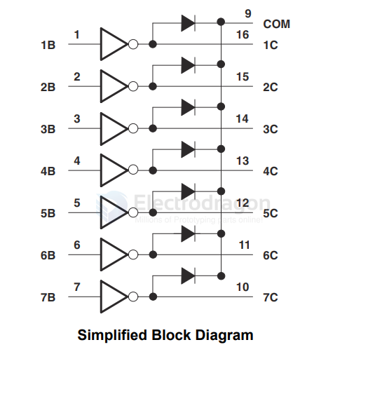
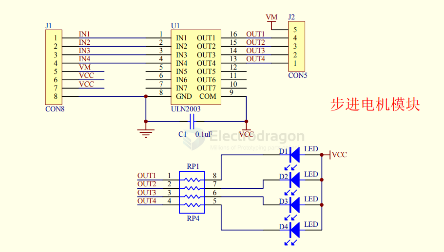
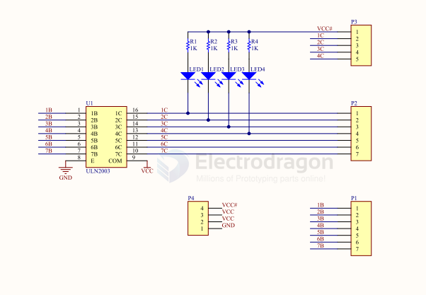
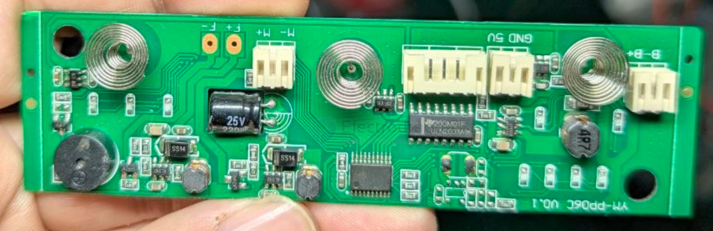

# ULN2003-dat

- [[TI-motor-dat]] - [[ULN2003-dat]] - [[Darlington-transistor-array-dat]]

- datasheet [[uln2003a.pdf]]

## SCH 

SCH2 

## build 

## ref 

- [chip link](https://www.ti.com/product/ULN2003A)

- [[ti-motor-dat]]