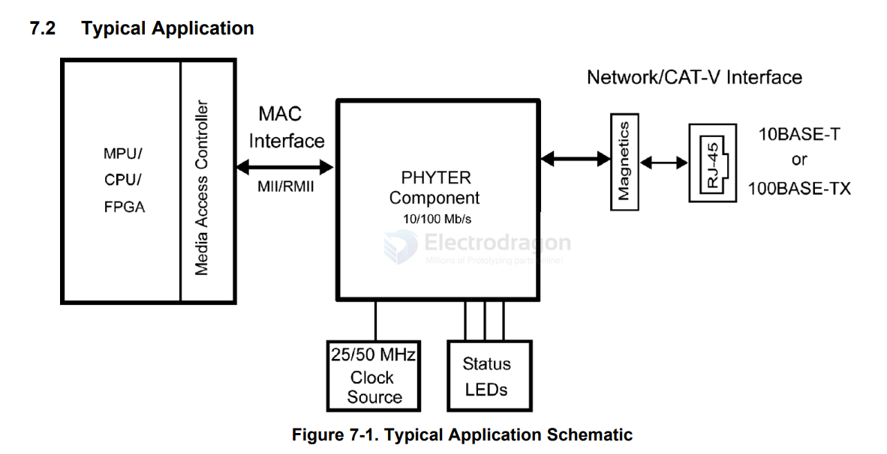

# DP83848-dat

- [[ti-network-dat]] - [[ethernet-dat]] 

- [[DP83848-dat]] == DP83848C/I/VYB/YB PHYTER™ QFP Single Port 10/100 Mb/s Ethernet Physical Layer Transceiver

## SCH 

- [[MAC-dat]] - [[CAT-V-dat]] - [[network-dat]] - [[ti-network-dat]] - [[ethernet-dat]] - [[DP83848-dat]] - [[ethernet-TPI-dat]]

## ref 

