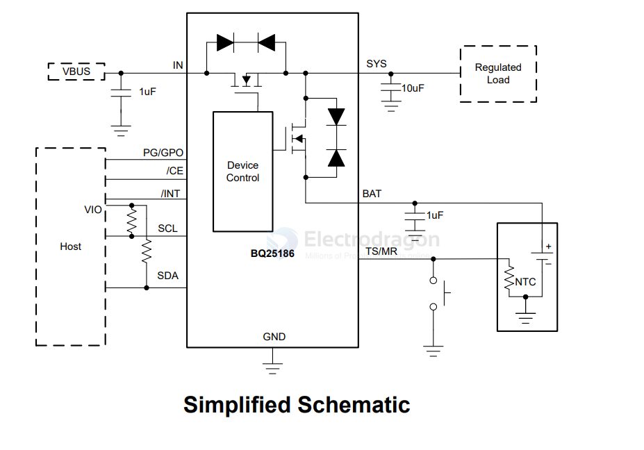

# BQ28186-dat

- [[BQ25186-dat]] - [[TI-power-dat]] - [[solar-charger-dat]]

- [[protection-power-dat]] - [[BQ25186-dat]]

## Features

1A linear battery charger

- 3.0V to 18V input voltage operating range for battery-to-battery charging, USB adapters, and high impedance sources.
- Configurable battery regulation voltage with 0.5% accuracy from 3.5V to 4.65V in 10mV steps
- Li-ion, Li-Poly, and LiFePO4 chemistry compatible
- 5mA to 1A configurable fast charge current
- 115mΩ battery FET ON resistance
- 55mΩ battery FET ON resistance
- Up to 3A discharge current to support high system loads
- Configurable NTC charging profile thresholds including JEITA support

• Power path management for powering the system and charging the battery
- Regulated system voltage (SYS) ranging from 4.4V to 5.5V addition to battery voltage tracking.
- Battery Tracking input voltage dynamic power management (VINDPM) for high impedance input sources

• Ultra low quiescent current
- 15nA Shutdown mode
- 3.2μA Ship mode with button press wake
- 4μA in Battery Only mode
- 30μA Input adapter Iq in sleep mode

• One push-button wake-up and reset input

• Integrated fault protection
- Input overvoltage protection (VIN_OVP)
- Battery short protection (BATSC)
- Battery overcurrent protection (BATOCP)
- Input current limit protection (ILIM)
- Thermal regulation (TREG) and thermal shutdown (TSHUT)
- Battery thermal fault protection (TS)
- Watchdog and safety timer fault

## SCH app. 

## ref 

https://www.ti.com/lit/ds/symlink/bq25186.pdf?ts=1787297955096&ref_url=https%253A%252F%252Fwww.ti.com%252Fproduct%252FBQ25186