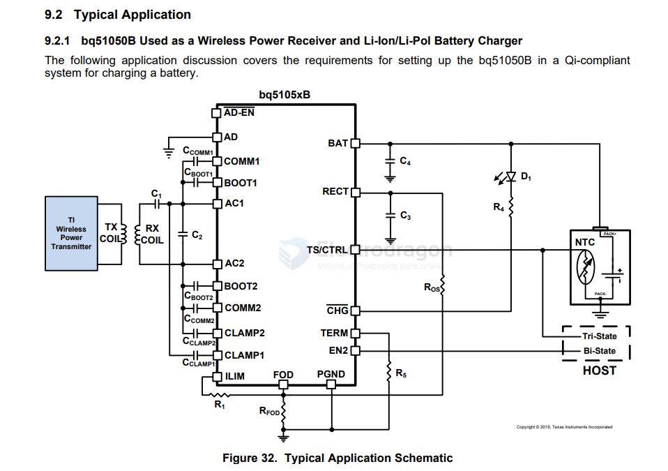

# BQ51050-dat

- [[OPM1168-dat]]

bq5105xB High-Efficiency Qi v1.2-Compliant Wireless Power Receiver and Battery Charger

## SCH and function 

- TERM 2.4K for 10% termination, so stop at 100M A

- TS/CTRL: Temperature Sense (TS) and Control (CTRL) pin functionality

## charge current Where 

- I_BULK is the programmed battery charge current during fast charge mode. When referring to the application diagram shown in Figure 32, 

- R_ILIM is the sum of RFOD and R1 (the total resistance from the ILIM pin to PGND).

datasheet == 
https://www.ti.com/lit/ds/symlink/bq51050b.pdf

## ref 

- [[wireless-charge-dat]]

- [[BQ51050]]