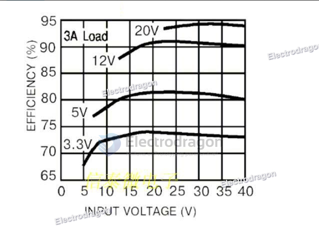
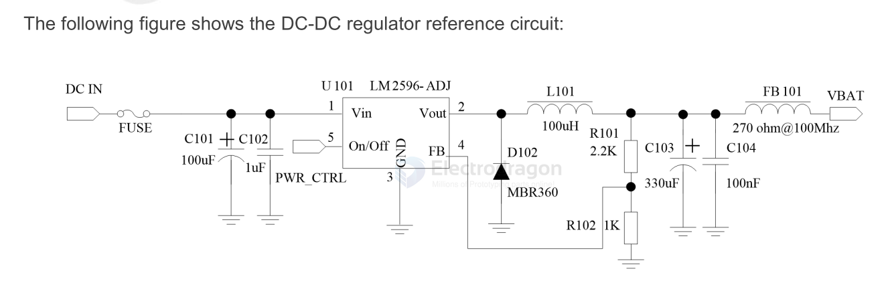

# LM2596-dat 

LM2596 SIMPLE SWITCHER® Power Converter 150-kHz 3-A Step-Down Voltage Regulator

https://www.ti.com/lit/ds/symlink/lm2596.pdf

https://www.ti.com/lit/ds/symlink/lm2596.pdf?ts=1696891822162

## Efficiency 

## ref sch 

## Modules 
- [[OPM1003-dat]] - [[OPM1026-dat]]