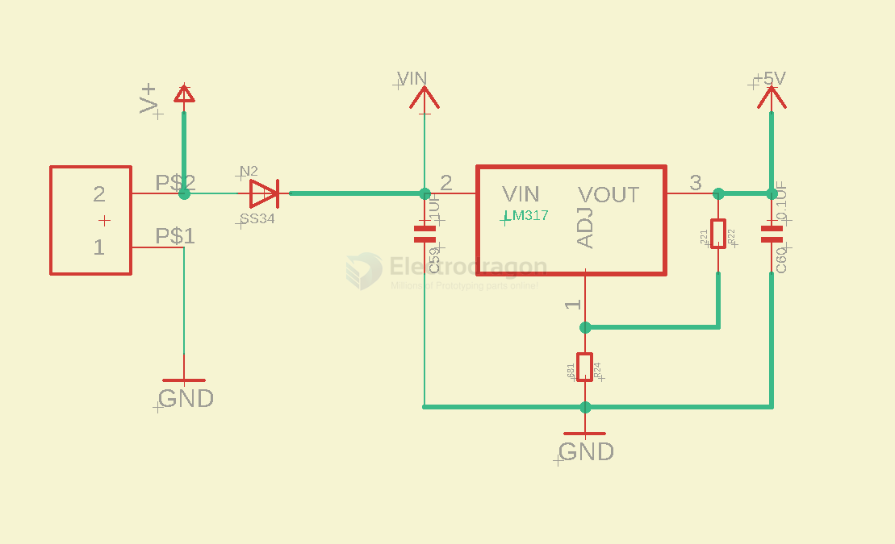
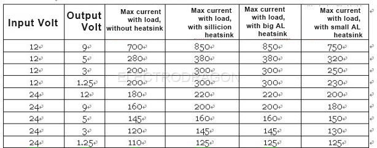

# LM317-dat

partner: [[Inrush-resistor-dat]]

The LM317 device is an adjustable three-terminal positive-voltage regulator capable of supplying more than 1.5 A over an output-voltage range of 1.25 V to 37 V. I


## board 

- [[OPM1087-dat]]


## 5V output 




## 12V output 

### 🔧 LM317 with R1 = 30kΩ and R2 = 290kΩ

#### 📘 Output Voltage Formula

```
Vout = 1.25V × (1 + R2 / R1) + Iadj × R2
```

Where:
- **1.25V** is the reference voltage
- **R1 = 30,000Ω**
- **R2 = 290,000Ω**
- **Iadj** (adjust pin current) is ~50µA, often ignored for most calculations

---

#### 🧮 Calculating Output Voltage (ignoring Iadj):


    Vout ≈ 1.25 × (1 + 290,000 / 30,000)
        ≈ 1.25 × (1 + 9.667)
        ≈ 1.25 × 10.667
        ≈ 13.33V


## Specs 




## ref 

- [[LDO-dat]]