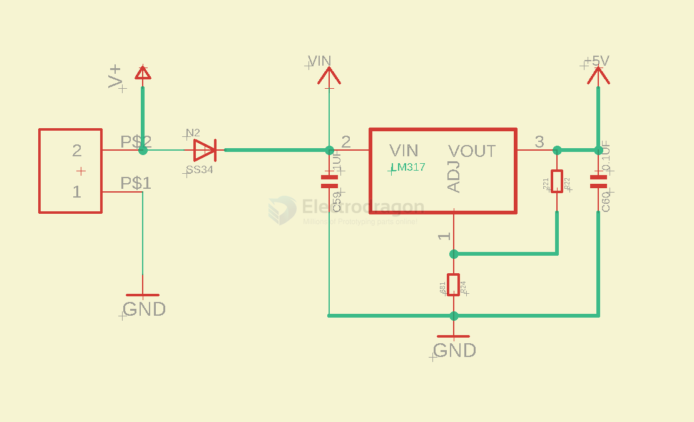
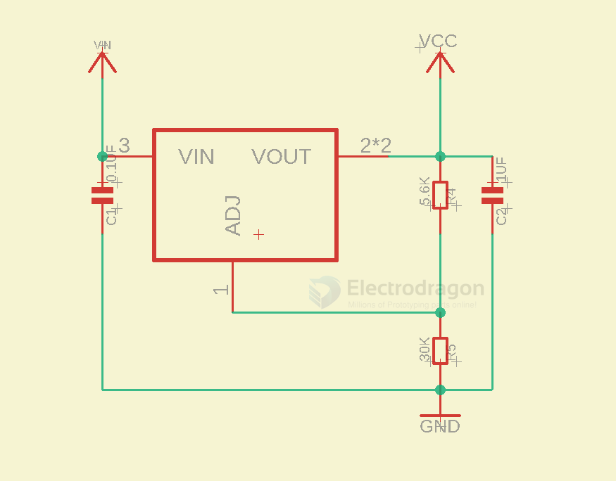
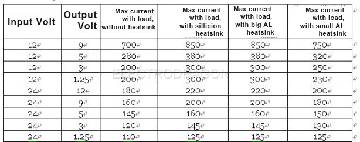

# LM317-dat


- [[L78-series-dat]] - [[L79-series-dat]] - [[LM317-dat]] - [[LDO-dat]]


partner: [[Inrush-resistor-dat]]

The LM317 device is an adjustable three-terminal positive-voltage regulator capable of supplying more than 1.5 A over an output-voltage range of 1.25 V to 37 V. I

[LM217T-DG](https://www.st.com/content/ccc/resource/technical/document/datasheet/group1/a0/db/e6/9b/6f/9c/45/7b/CD00000455/files/CD00000455.pdf/jcr:content/translations/en.CD00000455.pdf) -  1.2 V to 37 V adjustable voltage regulators


LM217, LM317


## board 

- [[OPM1087-dat]]


## 5V output 




## 12V output 

### 🔧 LM317 with R1 = 30kΩ and R2 = 290kΩ

#### 📘 Output Voltage Formula

```
Vout = 1.25V × (1 + R2 / R1) + Iadj × R2
```

Where:
- **1.25V** is the reference voltage
- **R1 = 30,000Ω**
- **R2 = 290,000Ω**
- **Iadj** (adjust pin current) is ~50µA, often ignored for most calculations

---

#### 🧮 Calculating Output Voltage (ignoring Iadj):


    Vout ≈ 1.25 × (1 + 290,000 / 30,000)
        ≈ 1.25 × (1 + 9.667)
        ≈ 1.25 × 10.667
        ≈ 13.33V

## 8V output 

R1 = 5.6K, R2 = 30K 




## Specs 




## ref 

- [[LDO-dat]]