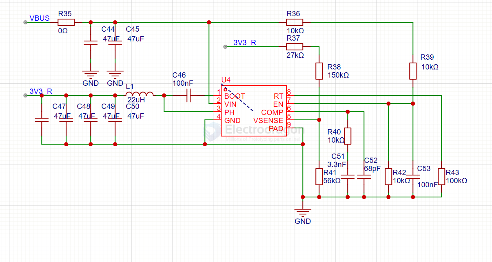
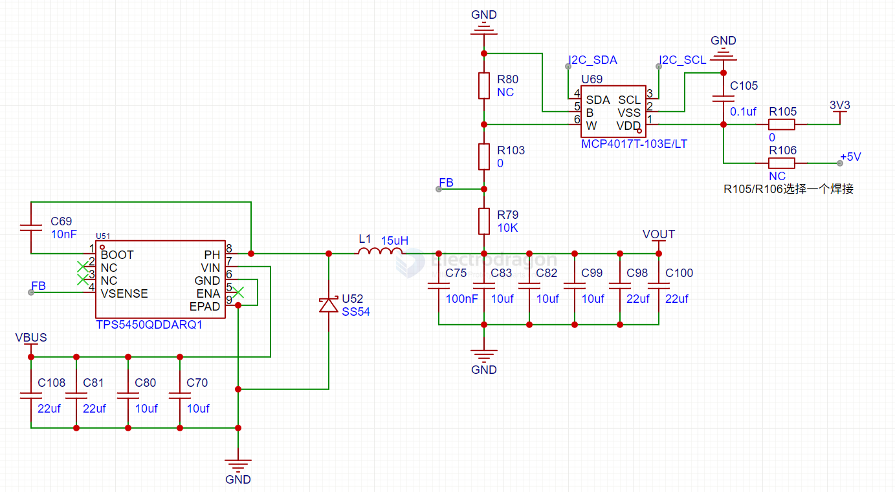

# TI-power-dat

## LDO 

LP3853/LP3856 3A Fast Response Ultra Low Dropout Linear Regulators

FEATURES
- Ultra Low Dropout Voltage
- Stable with Selected Ceramic Capacitors
- Low Ground Pin Current
- Load Regulation of 0.08%
- 10nA Quiescent Current in Shutdown Mode
- Ensured Output Current of 3A DC
- Available in TO-263 and TO-220 Packages
- Output Voltage Accuracy ± 1.5%
- Error Flag Indicates Output Status
- Sense Option Improves Load Regulation 
- Overtemperature/overcurrent Protection 
- -40°℃ to +125°C Junction Temperature Range

## buck regulator 

LM2853 3-A 550-kHz Synchronous Buck Regulator 

- • Input Voltage Range of 3 V to 5.5 V
- • Factory EEPROM Set Output Voltages From 0.8 V to 3.3 V in 100 mV Increments
- • Maximum Load Current of 3A
- • Voltage Mode Control
- • Internal Type-Three Compensation
- • Switching Frequency of 550 kHz
- • Low Standby Current of 12 µA
- • Internal 40 mΩ MOSFET Switches
- • Standard Voltage Options – 0.8/1.0/1.2/1.5/1.8/2.5/3.0/3.3 Volts
- • Exposed Pad 14-Lead HTSSOP (PWP) Package

## info 

- [[DCDC-down-dat]] - [[LDO-dat]]

- [[TPS54302-dat]] - [[LM2596-dat]]

- [[TPS5430-dat]]

**TPS54202** 4.5-V to 28-V Input, 2-A Output, EMI Friendly Synchronous Step Down Converter

- [[LM7805-dat]] - [[LM317-dat]]

- [[BQ51013-dat]] - [[BQ51050-dat]]

DCDC降压芯片用Ti的TPS54335A，支持4.5V-28V宽电压输入。

PUCC33421QDHARQ1 == UCC33421-Q1 Ultra-Small, 1.5W, 5.0V, 5kVRMS Isolation, Automotive DC/DC Module

BQxx 

- [[BQ24650-dat]] == Standalone 1-6 cell Buck battery charge controller with solar input and integrated MPPT

## TPS5450

TPS5450 5-A, Wide Input Range, Step-Down Converter

- [[MCP4017-dat]] - [[microchip-dat]]

## prebuild module 

PTH04T231WAD - Non-Isolated DC/DC Converters 6A 2.2V-5.5Vin Non- Iso Adj Pwr Module

## step-down 

TLV62130RGTR - TLV62130x 3-V to 17-V 3-A Step-Down Converter In 3x3 QFN Package - Buck Switching Regulator IC Positive Adjustable 0.9V 1 Output 3A 16-VFQFN Exposed Pad

## LDO 

TPS74401-EP == 3.0-A ULTRA-LDO WITH PROGRAMMABLE SOFT-START

TPS7A89 == Small, Dual, 2-A, Low-Noise (3.8 μVRMS), LDO Voltage Regulator

TPS76350DBVR == 150-mA, 10-V, low-dropout voltage regulator with enable

TPS7A45xx Low-Noise Fast-Transient-Response 1.5-A Low-Dropout Voltage Regulators - TPS7A4501, TPS7A4515, TPS7A4518, TPS7A4525, TPS7A4533

[LM78L - LM78L 100-mA Fixed Output Linear Regulator](https://www.ti.com/lit/ds/symlink/lm78l.pdf?ts=1769674083676)

LM3940 1-A Low-Dropout Regulator for 5-V to 3.3-V Conversion

The LM3940 is a 1-A low-dropout regulator designed to provide 3.3 V from a 5-V supply.

## design 

### parallel 

Two LDOs cannot simply be paralleled to get double the current unless they are specifically designed for current sharing.

Workaround - Add small ballast resistors (common workaround)

    LDO1 ──0.1Ω──┐
                ├── Vout
    LDO2 ──0.1Ω──┘

Resistors force current sharing

Typical values: 50–200 mΩ

Trade-offs:
- Voltage drop
- Worse load regulation
- Extra heat

⚠️ Still not ideal for high precision or high current

Better solutions (recommended)

Use one higher-current LDO
- Simplest
- Most reliable

Use a switching regulator + LDO
- Buck converter for current
- LDO for low noise

Use a regulator family designed for paralleling
- Some PMICs allow this

## ref 

- [[TI-dat]]

- [[dcdc-down]] - [[ti-power]]