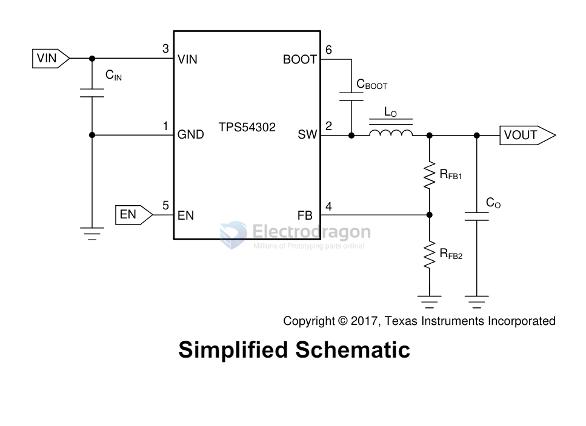

# TI-power

## TPS54302 

| Parts | Common Value | Note |
| ----- | ------------ | ---- |
| Cin   | 10+0.1       |      |
| Cboot | 0.1          |      |
| Lo    | 10uh         |      |
| Rfb1  | 100K         |      |
| Rfb2  | 13.3K        |      |
| Cfb   | 75pf         |      |
| Co    | 22uf x2      |      |

- [[dcdc-bulk-output-dat]]

