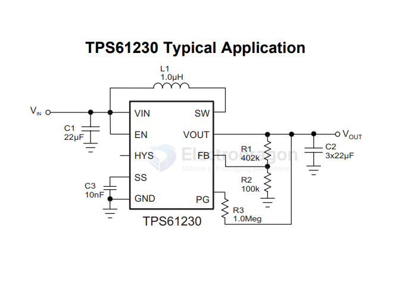
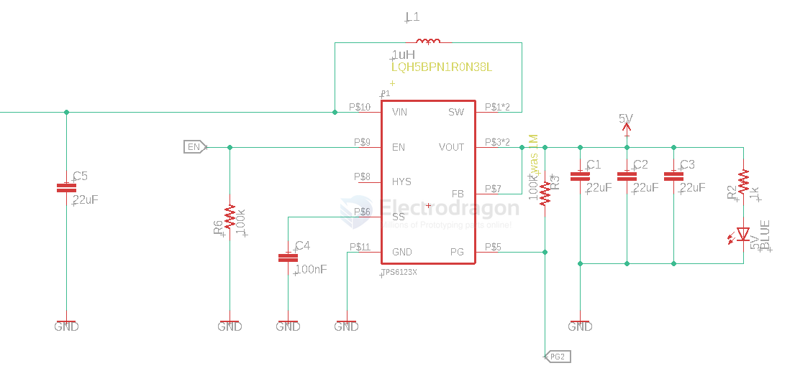

# TPS6123x-dat

- [[TPS6123x-dat]] - [[TI-power-dcdc-boost-dat]]

## TPS6123x

TPS61230, TPS61231, TPS61232 - TPS6123x High Efficiency Synchronous Step Up Converters with 5-A Switches

Applications
- Low Voltage Li-lon Battery Powered Products USB Power Supply
- Tablet PCs
- Power Banks, Battery Backup Units
- Industrial Metering Equipments

## SCH 

## ref 