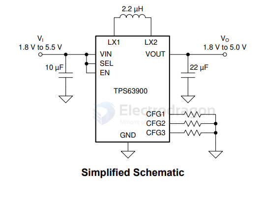
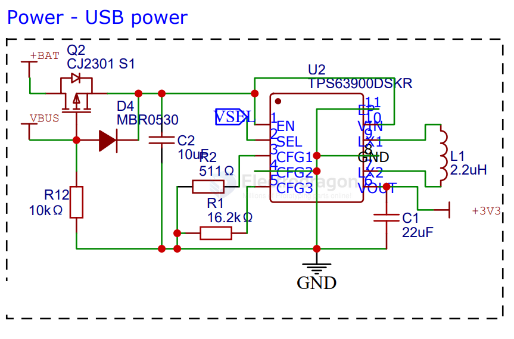
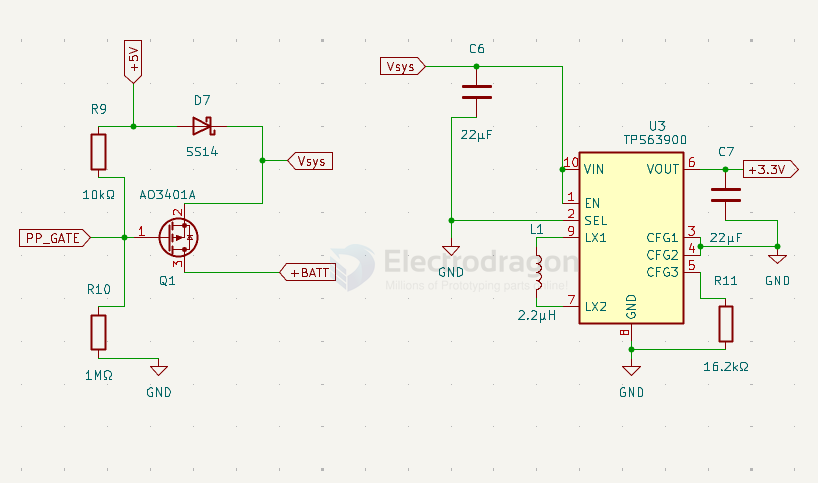

# TPS63900-dat

- [[TI-power-dcdc-boost-down-dat]] - [[TI-power-dat]] - [[TI-dat]] - [[TPS63900-dat]]

TPS63900 1.8-V to 5.5-V, 75-nA IQ Buck-boost Converter with Input Current Limit and DVS

## SCH 

## build 

build 2 - power switch from VUSB or VBAT 

## ref 