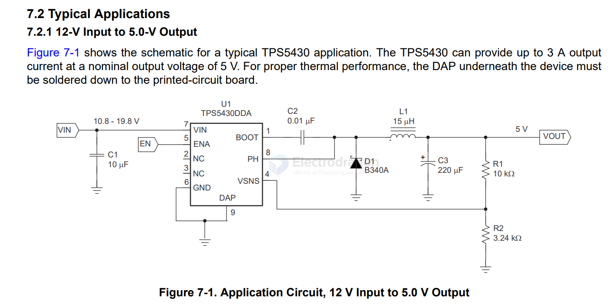

# TPS5430-dat

TPS543x 3A, Wide Input Range, Step-Down Converter

Wide input voltage range:
– TPS5430: 5.5V to 36V
– TPS5431: 5.5V to 23V

Available in small thermally enhanced 8-pin SO PowerPAD™ integrated circuit package

- [[resistor-feedback-dat]] 

## ref 

- [[ti-power-dat]]