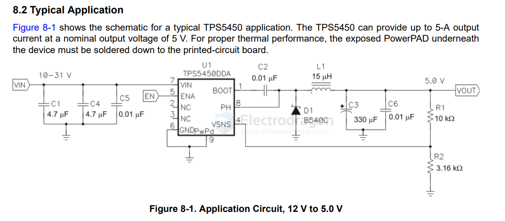
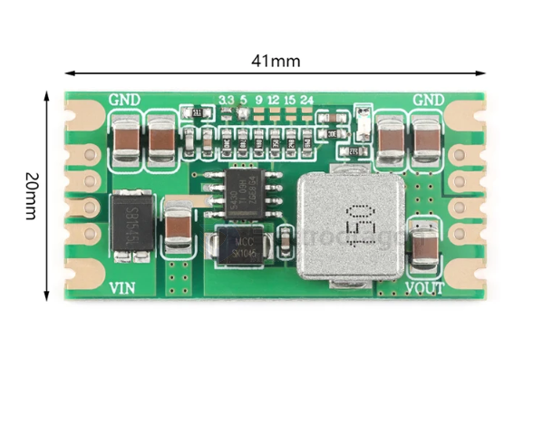

# TPS5450-dat

- [[diode-dat]] - [[inductor-dat]] - [[capacitor-dat]]

## TPS5450

- [[TPS5450-dat]] 

TPS5450 5-A, Wide Input Range, Step-Down Converter

1 Features

- • Wide input voltage range: 5.5 V to 36 V
- • Up to 5-A continuous (6-A peak) output current
- • High efficiency greater than 90% enabled by 110- mΩ integrated MOSFET switch
- • Wide output voltage range: adjustable down to 1.22 V with 1.5% initial accuracy
- • Internal compensation minimizes external part count
- • Fixed 500-kHz switching frequency for small filter size
- • 18-μA shutdown supply current
- • Improved line regulation and transient response by input voltage feedforward
- • System protected by overcurrent limiting, overvoltage protection, and thermal shutdown
- • –40°C to 125°C operating junction temperature range
- • Available in small thermally enhanced 8-pin SOIC PowerPAD™ package

## ref 

