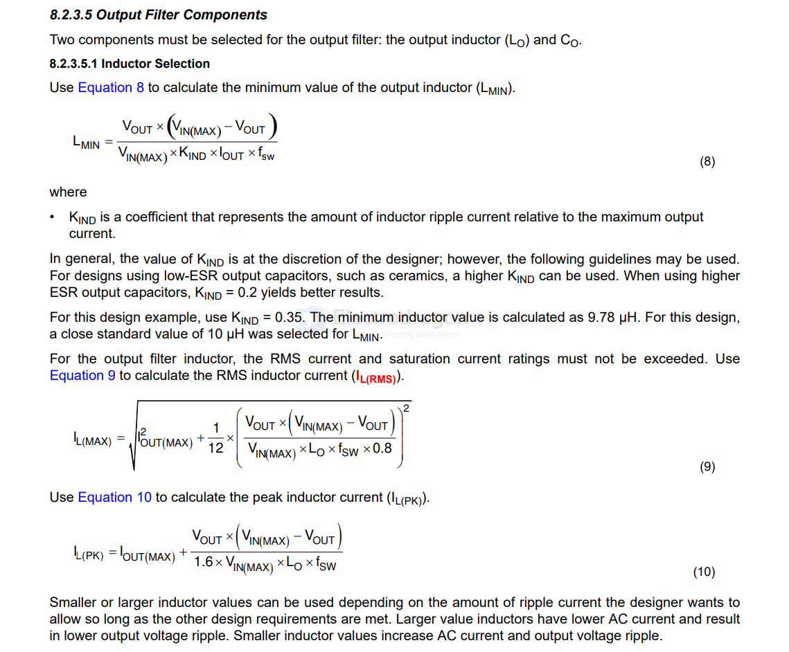

# TPS54302-dat

TPS54302 4.5-V to 28-V Input, 3-A Output, EMI-Friendly Synchronous Step-Down Converter

| Parts | Common Value | Note |
| ----- | ------------ | ---- |
| Cin   | 10+0.1       |      |
| Cboot | 0.1          |      |
| Lo    | 10uh         |      |
| Rfb1  | 100K         |      |
| Rfb2  | 13.3K        |      |
| Cfb   | 75pf         |      |
| Co    | 22uf x2      |      |

- [[dcdc-down-output-dat]]

https://www.ti.com/lit/ds/symlink/tps54302.pdf

## inductor 

Lmin = [ 5V * (18V-5V) ] / 18V * Kin * Iout * Fsw

For this design example, use KIND = 0.35. The minimum inductor value is calculated as 9.78 μH. For this design, a close standard value of 10 μH was selected for LMIN.

- Larger value inductors have lower AC current and result in lower output voltage ripple. 
- Smaller inductor values increase AC current and output voltage ripple.

- [[inductor]]

## ref 

- [[TPS54302]]