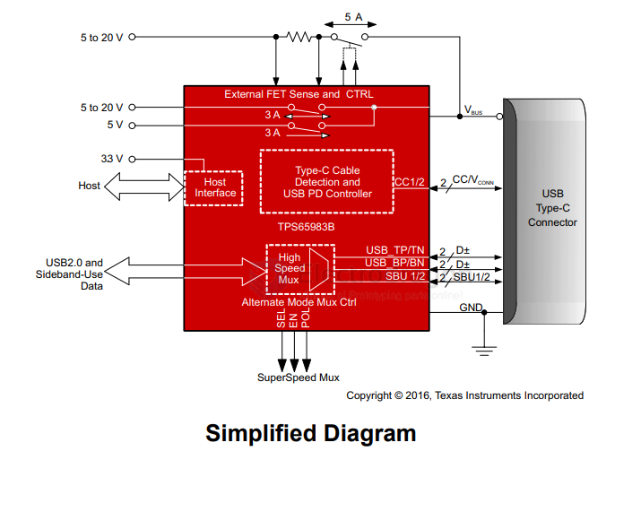
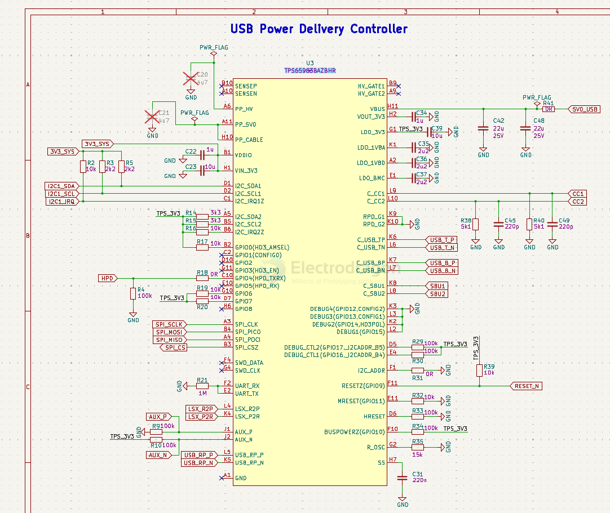

# TPS65983B-dat

- [[TI-Power-dat]] - [[TPS65983B-dat]] - [[USB-PD-dat]] - [[USB-thunderbolt-dat]]

TPS65983B USB Type-C® and USB PD Controller, Power Switch, and High Speed Multiplexer For Thunderbolt 3

USB Type-C® and USB-C® Power Delivery 3.0 controller | ZBH | 96 | -10 to 85

## diagram 

## SCH 

## ref 

