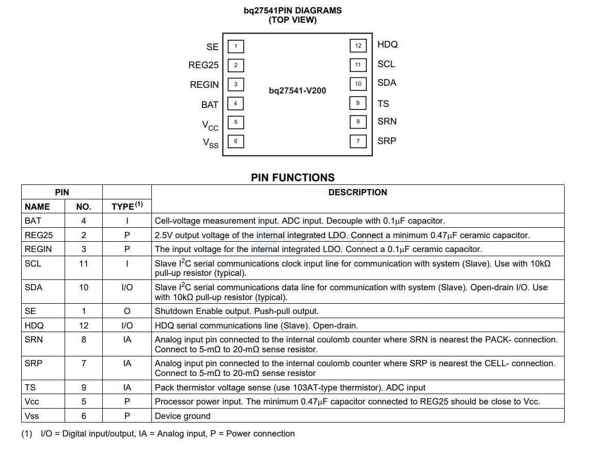

# bq27541-dat

## ref 

https://blog.ja-ke.tech/2021/03/25/oneplus-battery-protection.html

DSLogic Plus - [[logic-analyzer-dat]]

- [[I2C-dat]]

## info 

[Single Cell Li-Ion Battery Fuel Gauge for Battery Pack Integration](https://e2e.ti.com/cfs-file/__key/communityserver-discussions-components-files/196/bq27541_5F00_V200_5F00_DS.pdf)

The protocol description is detailed, important information for the start is on page 32:

## ref 

- [[ti-power-dat]]