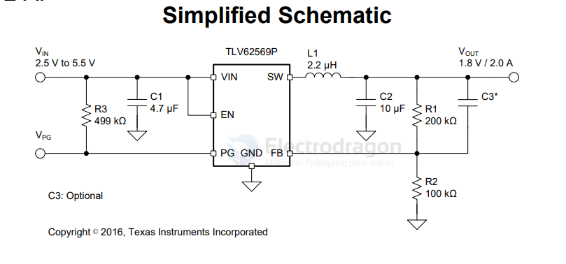
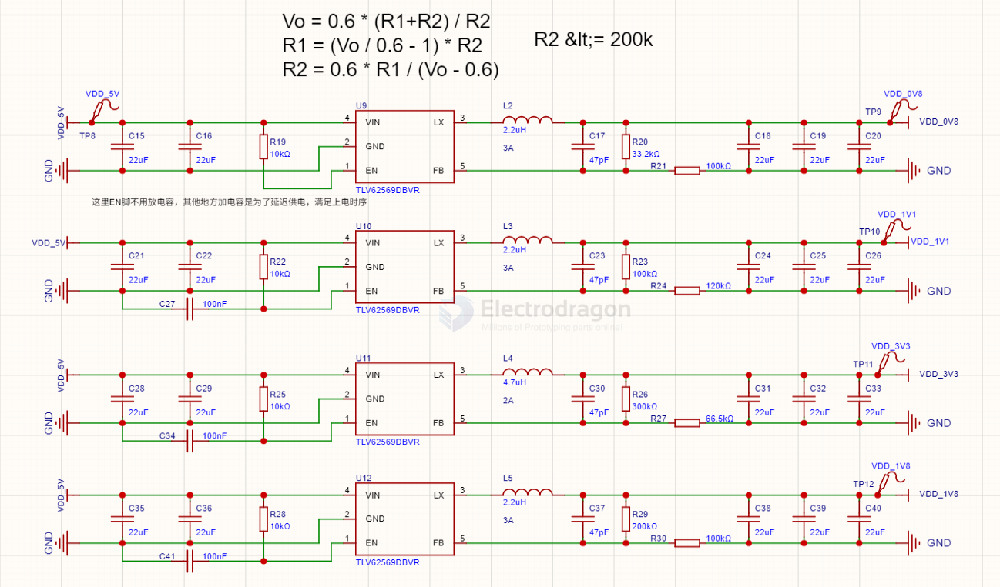

# tlv62569-dat

- [[dcdc-down-dat]] - [[TI-power-dat]] - [[tlv62569-dat]]

https://www.ti.com/lit/ds/symlink/tlv62569.pdf

TLV62569 2-A High Efficiency Synchronous Buck Converter in SOT Package

At medium to heavy loads, the device operates in pulse width modulation (PWM) mode with 1.5-MHz switching frequency. At light load, the device automatically enters Power Save Mode (PSM) to maintain high efficiency over the entire load current range. 

In shutdown, the current consumption is reduced to less than 2 μA.

## SCH 

## build 

SCH 1 0.8V 1.1V 3.3V 1.8V 

## ref 

