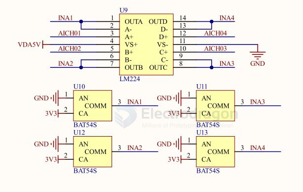

# LM224-dat

[LM124, LM224x, LM324x == Low-power quad operational amplifiers](https://www.st.com/resource/en/datasheet/lm224a.pdf)

## How the LM224 works:

- It contains four independent op-amps in a single package.
- Each op-amp amplifies the voltage difference between its two input pins (inverting and non-inverting).
- It is designed for single or dual power supply operation, making it versatile for many analog signal processing tasks.
- Typical uses include signal amplification, filtering, and mathematical operations (summing, integration, etc.).
- The LM224 is optimized for low power consumption and can operate from a wide range of supply voltages.

