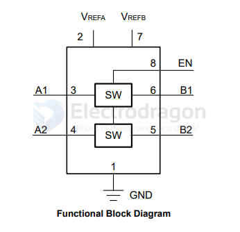

# TI-Signal-dat

- [[TXB0108-dat]] - [[TXS0108-dat]]

- [[LSF0102-dat]]

LSF0102 2 Channel Auto-Bidirectional Multi-Voltage Level Translator for Open-Drain and Push-Pull Applications

https://www.ti.com/product/LSF0102/part-details/LSF0102DCUR

Allows bidirectional voltage-level translation between
- 0.95V ↔ 1.8/2.5/3.3/5V
- 1.2V ↔ 1.8/2.5/3.3/5V
- 1.8V ↔ 2.5/3.3/5V
- 2.5V ↔ 3.3/5V
- 3.3V ↔ 5V

