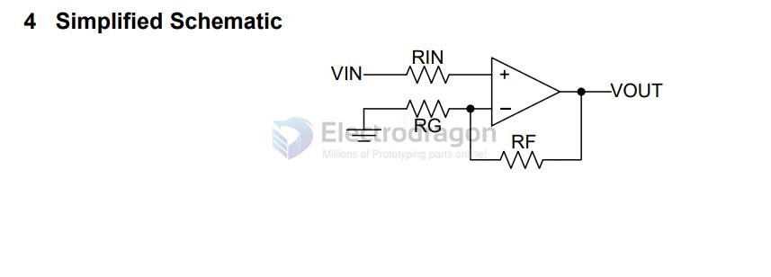
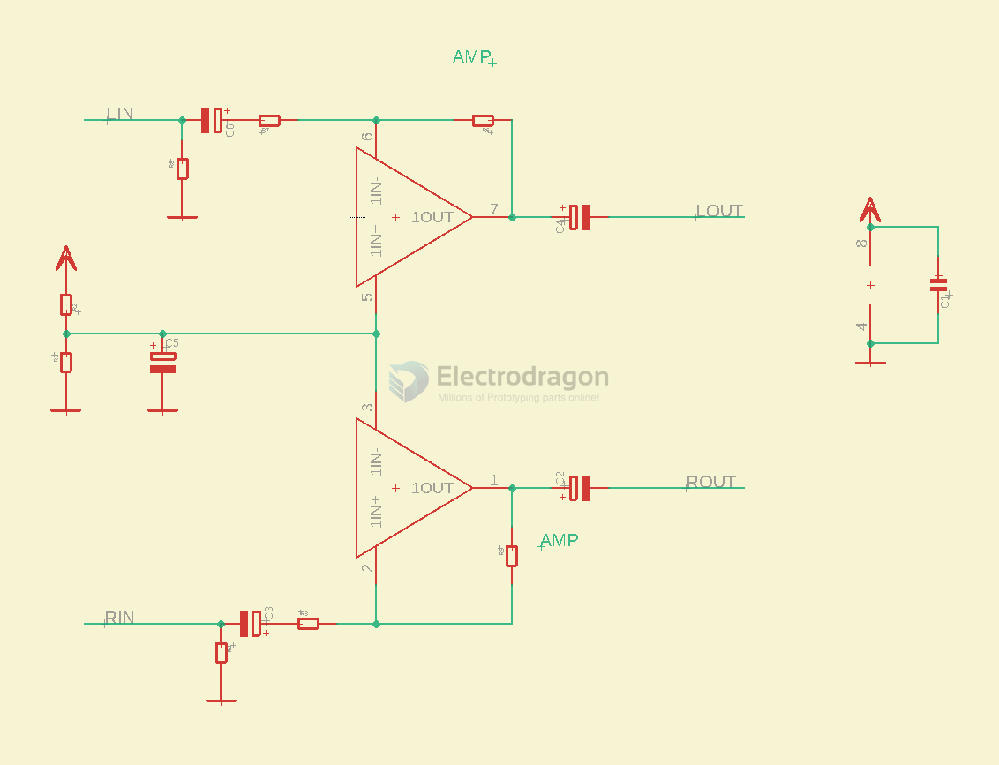

# NE5532-dat

- [chip DS ](https://www.ti.com/lit/ds/symlink/ne5532.pdf)

NE5532x, SA5532x Dual Low-Noise Operational Amplifiers

## boards 

- [[AMP1017-dat]]

## appliction amplifier 

VCC+ Supply voltage: 5 ~ 15 V

d

## audio amplifier SCH 

- [[virtual-ground-dat]] - by [[voltage-divider-dat]]

the gain is 15K / 2.2K 

## ref

- [[TI-dat]] - [[resistor-dat]]