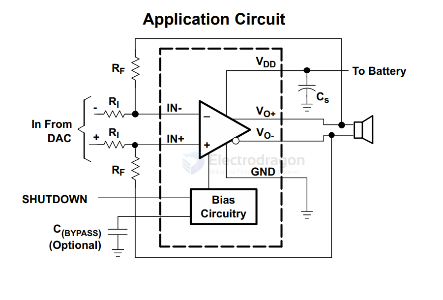

# TI-audio-dat

TPA6205A1 1.25-W Mono Fully Differential Audio Power Amplifier With 1.8-V Input logic Thresholds

- [[DAC-dat]]

- [[TI-AMP-dat]] - [[TI-audio-dat]]

- [[TPA3116-dat]]

- [[PCM2906-dat]] - [[PCM5122-dat]] - [[PCM5102-dat]]

- [[audio-dat]]

- [[NE5532-dat]]

- [[PCM1804-dat]]

- [[amplifier-audio-dat]]

## ref 

- [[TI-dat]] - [[TI-audio]] - [[TI]]