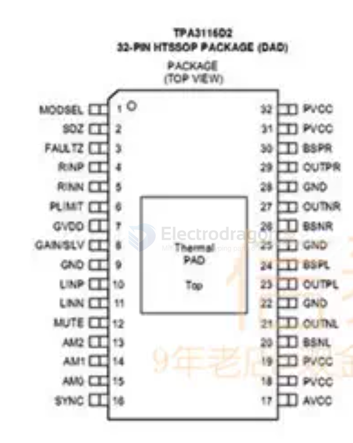
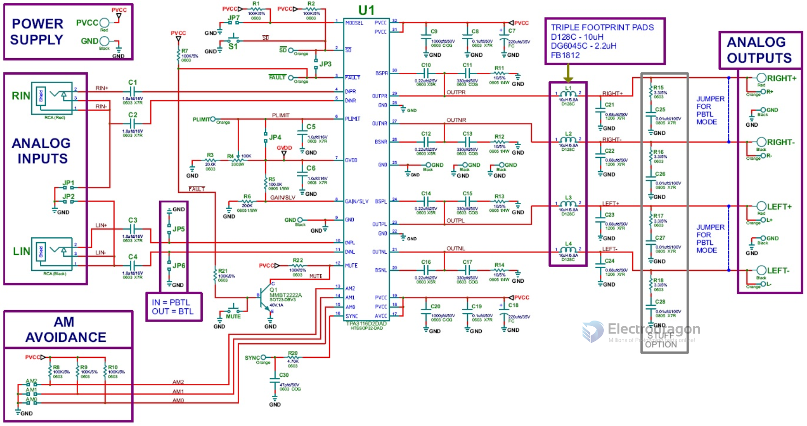
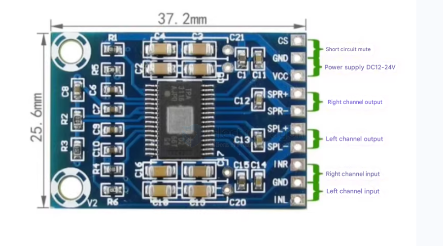
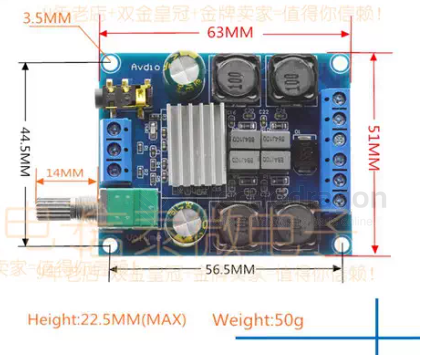
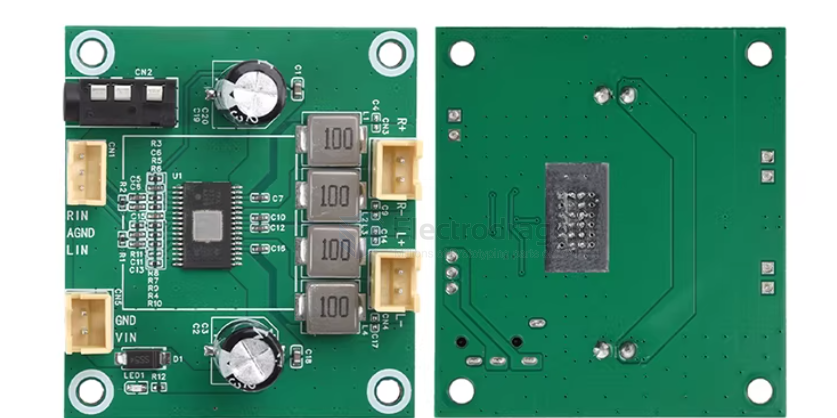
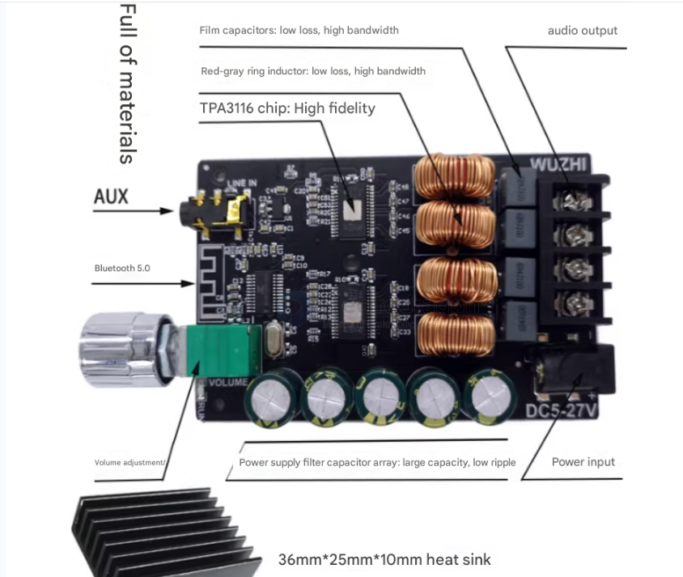
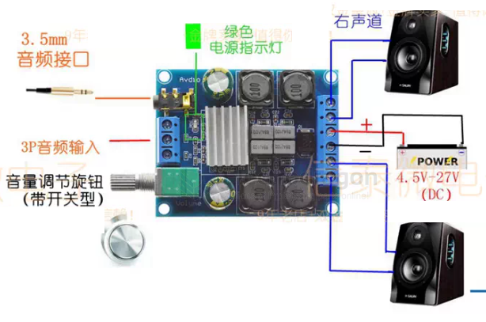

# TPA3116-dat

- [[TPA3116-dat]] - [[ti-audio-dat]] - [[AMP1003-dat]]

https://www.ti.com/product/TPA3116D2

50-W stereo, 100-W mono, 4.5- to 26-V supply, analog input Class-D audio amplifier w/ SpeakerGuard™

https://www.electrodragon.com/product/210w-dual-channel-hifi-mini-audio-amplifier-pam8610/

## chip info 

宽电压范围：12V至26V

高效D类运行，兼具>90%的功率效率与低空闲损耗特性，高级调制系统配置，多重开关频率，AM干扰防止

TPA3116D2高级振荡器/PLL电路采用多开关频率选项来抑制AM干扰：搭配使用主从模式选项时，还可使多个器件实现同步

TPA3116D2器件针对短路、过热、过压、欠压和直流等故障提供了全面保护。在过载情况下，器件会将故障情况报告给处理器，从而避免自身适到损坏

- [[inductor-dat]] 

## SCH 

## common board 

## wiring guide 

## usage note 

1.如何选择电源？

板子搭配的电源很关键。电压越高，电流越大，输出功率越足，要是你只有12V1A，这样可以带3-4寸音箱。如果你是19V5A以上，带8-10寸没问题、电源必须高度重视。如果电压太低声音放大后容易引起声音失真，如果电流太小带不起来喇叭会把电压拉低，工作不正常或音质变差。
推荐使用18V19V24V的电源，电流5A以上。如果您只有9V12V或1A2A的电源，也可以用但是功率小，注意使用时音量放到最大可能会失真，影响音质。

2.如何选择喇叭？

常用的喇叭一般都是4-8欧姆的，可以不区分正负极性，效果是一样的。如果您的喇叭功率小，可能介于20W-50W之间也是可以用的，供电电压小一些防止放大声后烧毁喇叭，比如选15V以下的电源。如果您是100W-200w的喇叭，不用担心喇叭烧坏的问题，可以选择12-24V的电源，选择的电压越高，那么可输出的声音或者功率越大。喇叭功率不易超过200W，否则会影响音质。

## ref 

- [[ti-audio-dat]]