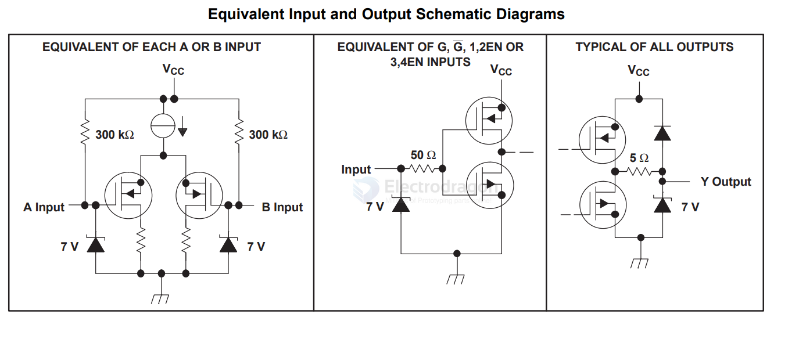
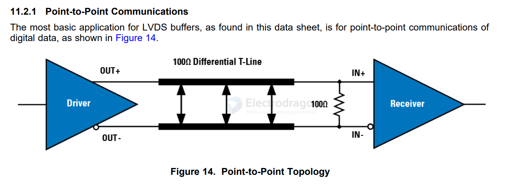

# SNx5LVDSxx-dat

- [[SNx5LVDSxx-dat]] - [[LVDS-dat]] - [[TI-dat]] - [[TI-interface-dat]] - [[differential-line-receiver-dat]]

SN55LVDS32, SN65LVDS32, SN65LVDS3486, SN65LVDS9637

SNx5LVDS3xxxx High-Speed Differential Line Receivers

The SN55LVDS32, SN65LVDS32, SN65LVDS3486,and SN65LVDS9637 devices are differential linereceivers that implement the electrical characteristicsof low-voltage differential signaling (LVDS). 

This signaling technique lowers the output voltage levelsof 5-V differential standard levels (such as EIA/TIA-422B) to reduce the power, increase the switchingspeeds, and allow operation with a 3.3-V supply rail.Any of the differential receivers provides a validlogical output state with a ±100-mV differential inputvoltage within the input common-mode voltage range.The input common-mode voltage range allows 1V of ground potential difference between two LVDS nodes.

## diagram 

## application 

## ref 