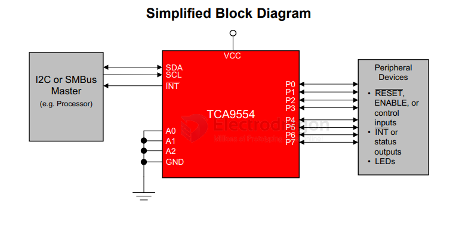
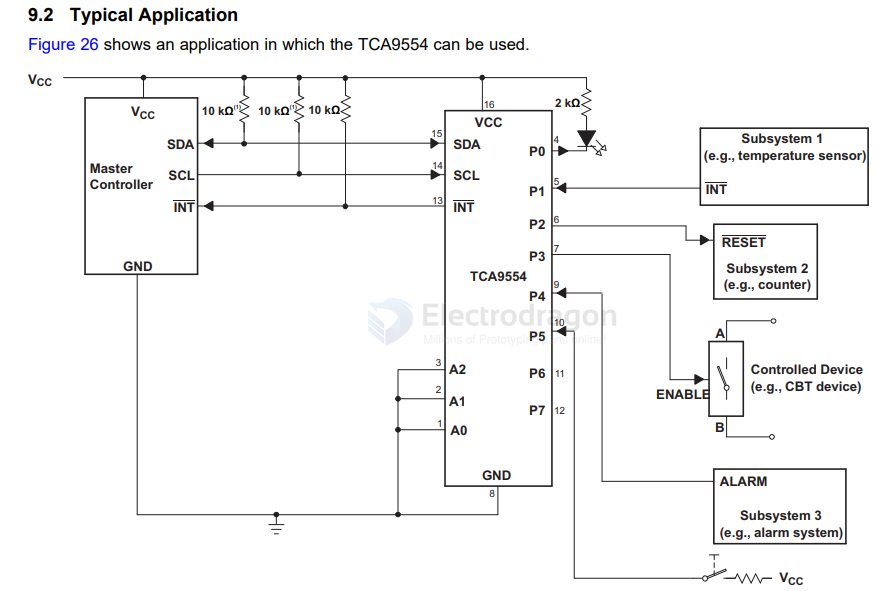

# TCA9554-dat

- [[TCA9554-dat]] - [[TI-interface-dat]] - [[TI-dat]] - [[IO-expander-dat]]

The TCA9554 is a 16-pin device that provides 8 bits of general purpose parallel input and output (I/O) expansion for the two-line bidirectional I 2C bus (or SMBus) protocol. 

The device can operate with a power supply voltage ranging from 1.65 V to 5.5 V. 

The device supports both 100-kHz (Standard-mode) and 400-kHz (Fast-mode) clock frequencies. 

I/O expanders such as the TCA9554 provide a simple solution when additional I/Os are needed for switches, sensors, push-buttons, LEDs, fans, and other similar devices

TCA9554 Low Voltage 8-Bit I2C and SMBus Low-Power I/O Expander With Interrupt Output and Configuration Registers

## SCH 

## ref 

