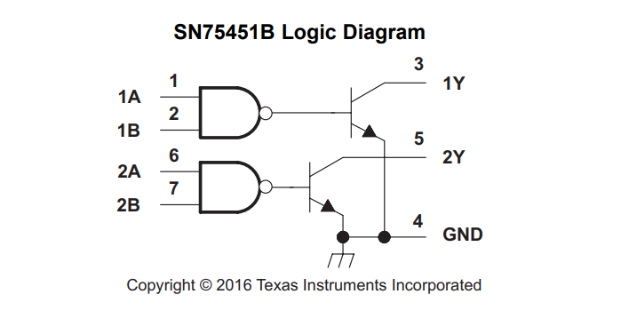

# TI-logic-dat

- [[TXS0102-dat]] - [[TXS0108-dat]] - [[TI-logic-dat]]

## SN75451B == 75451

https://www.ti.com/product/SN75451B

https://www.ti.com/lit/ds/symlink/sn75451b.pdf?ts=1745835022127&ref_url=https%253A%252F%252Fwww.ti.com%252Fproduct%252FSN75451B

SN5545xB, SN7545xB Dual-Peripheral Drivers for High-Current, High-Speed Switching

1 Features
- Characterized for Use to 300 mA
- High-Voltage Outputs up to 30 V
- No Output Latch-Up at 20 V (After Conducting 300 mA)
- High-Speed Switching
- Open-Collector Outputs
- Circuit Flexibility for Varied Applications
- TTL-Compatible Diode-Clamped Inputs
- Standard Supply Voltages

2 Applications
- High-Speed Logic Buffers
- Power Drivers
- Lamp Drivers
- LED Drivers
- Line Drivers
- Memory Drivers

## ref 

- [[transistor-array-dat]] - [[transistor-dat]]

- [[BOM-dat]]