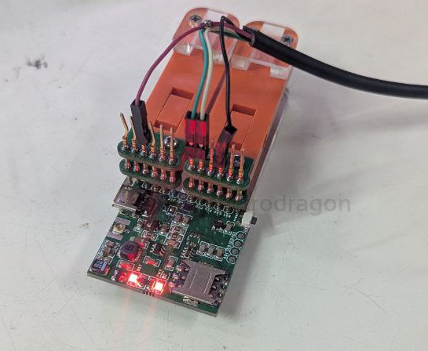

# TXS0102-dat

- [[voltage-dat]] - [[logic-level-shifter-dat]] - [[VBAT-dat]] - [[VDD_ext-dat]] == 1.8V 

| type          | footprint | info                                 |
| ------------- | --------- | ------------------------------------ |
| LSF0102DPH    | TSSOP-8   | 2位双向多电压电平转换器开放式排水    |
| LSF0102DCTR   | MSOP-8    | 双通道自动双向多电压电平转换器芯片   |
| LSF0102DCUR   | VSSOP-8   | 双通道自动双向多电压电平转换器芯片   |
| NTS0102DP,125 | TSSOP-8   | 双电源转换收发器芯片 排水明沟        |
| NXB0102GTX    | XSON-8    | 双电源转换收发器；自动方向感应；三态 |
| TXS0102 DQER   | X2SON-8   | 适用于漏极开路 2位双向电压电平转换器 |
| TXS0102 DCUR   | VSSOP-8   | 2位双向电压电平转换器芯片            |
| TXS0102 DCTR   | MSOP-8    | 2位双向电压电平转换器IC芯片          |
| TXB0102 DCUR   | VSSOP-8   | 2位双向电压电平转换器芯片            |

- [[PCB-footprint-dat]] 

`TXS0102DCUR` - `VSS0P-8`

TXS0102DCUT

TXS0102 DCUR

TXS0102 DQER `X2SON-8` 

mark == `NFER`

- [[PCB-footprint-dat]]

## test 

- 3.3V/5V set to 5V VUSB 
- wiring VBUS, TXD RXD, GND 
- 

## wiring 

Normal Operation: Both $V_{CCA}$ and $V_{CCB}$ must be actively powered within their specified operating ranges ($1.65\text{V} \le V_{CCA} \le 3.6\text{V}$ and $2.3\text{V} \le V_{CCB} \le 5.5\text{V}$), keeping the condition that $V_{CCA} \le V_{CCB}$. Decoupling capacitors (e.g., $0.1\,\mu\text{F}$) should be placed close to each supply pin.

## ref 

- [[serial-dat]]