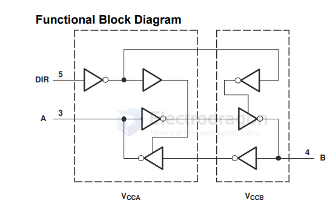
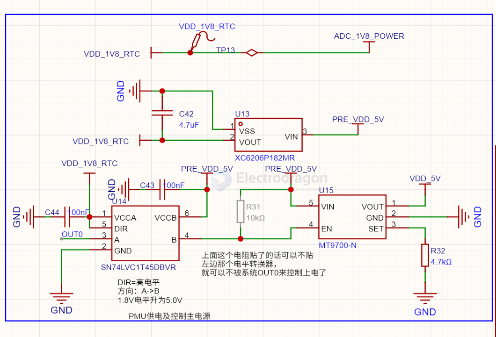

# sn74lvc1t45-dat

- [[LDO-dat]] - [[logic-level-shifter-dat]] - [[sn74lvc1t45-dat]] - [[ti-logic-dat]]

https://www.ti.com/lit/ds/symlink/sn74lvc1t45.pdf

This single-bit noninverting bus transceiver uses two separate configurable power-supply rails. 

The A port is designed to track VCCA. VCCA accepts any supply voltage from 1.65V to 5.5V. 

The B port is designed to track VCCB. VCCB accepts any supply voltage from 1.65V to 5.5V. 

This allows for universal low-voltage bidirectional translation between any of the 1.8V, 2.5V, 3.3V, and 5V voltage nodes.

## diagram 

## build 

build 1 SCH 

## ref 

