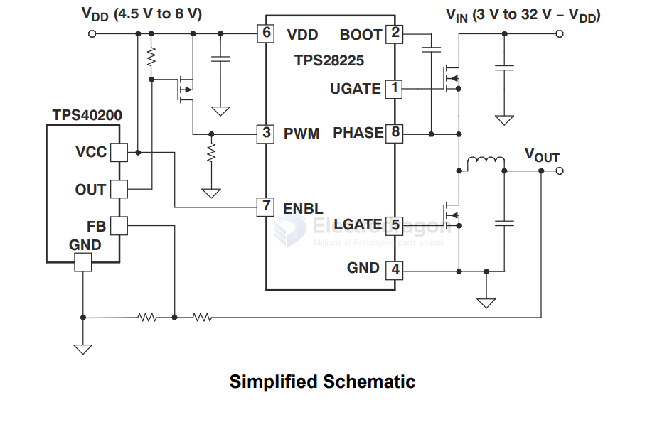

# TPS28225-dat 

- [[TPS40200-dat]] - [[TPS28225-dat]] - [[TI-mosfet-driver-dat]] - [[mosfet-dat]] - [[mosfet-driver-dat]] - [[TI-dat]]

TPS28225 High-Frequency 4A Sink Synchronous MOSFET Driver

27V 2A/4A half-bridge gate driver with 4V UVLO for synchronous rectification

- [[power-dat]] - [[power-UVLO-dat]]

## build 

- [[power-wireless-TX-dat]] - [[TPS40200-dat]] - [[TPS28225-dat]] - [[TI-mosfet-driver-dat]] - [[mosfet-dat]] - [[mosfet-driver-dat]] - [[BQ500212-dat]] 

## SCH 

## ref 

