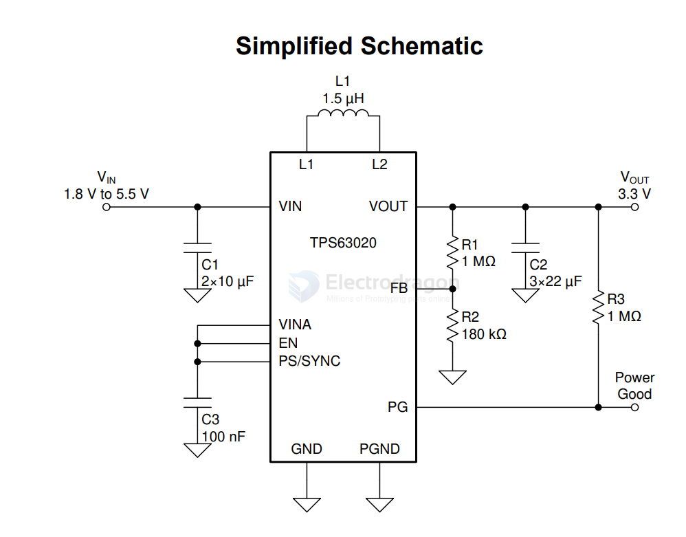

# TI-power-dcdc-boost-down-dat

- [[ti-power-dat]] - [[TI-power-dcdc-down-dat]] - [[ti-power-dcdc-boost-dat]] - [[ti-power-dcdc-boost-down-dat]] - [[TI-LDO-dat]]

- [[TI-power-dcdc-boost-down-dat]] - [[TI-power-dat]] - [[TI-dat]] - [[TPS63900-dat]]

[TPS63020, TPS63021](https://www.ti.com/lit/ds/symlink/tps63020.pdf)

TPS6302x High Efficiency Single Inductor Buck-boost Converter with 4-A Switches

The TPS6302x devices provide a power supply solution for products powered by either a two-cell or three-cell alkaline, NiCd or NiMH battery, a one-cell Li-ion or Li-polymer battery, supercapacitors or other supply rails. Output currents up to 3 A are supported.

## ref 