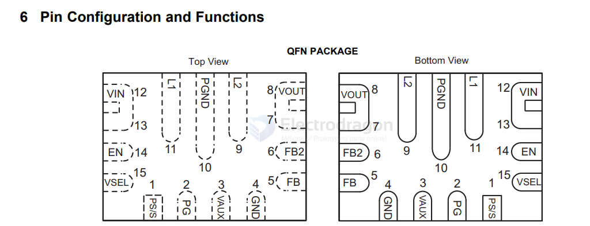
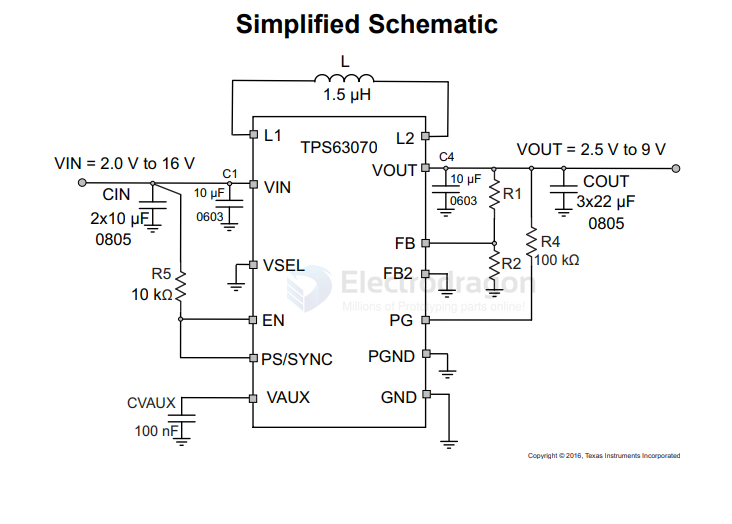

# TPS63070-dat

- [[ti-power-dat]] - [[ti-power-dcdc-boost-down-dat]] - [[TPS63070-dat]] 

TPS63070 2-V to 16-V Buck-Boost Converter With 3.6-A Switch Current

https://www.ti.com/lit/ds/symlink/tps63070.pdf

## pin 

VOUT == 7 and 8 

## SCH 

## apps 

- [[X12-dat]] 

## ref 