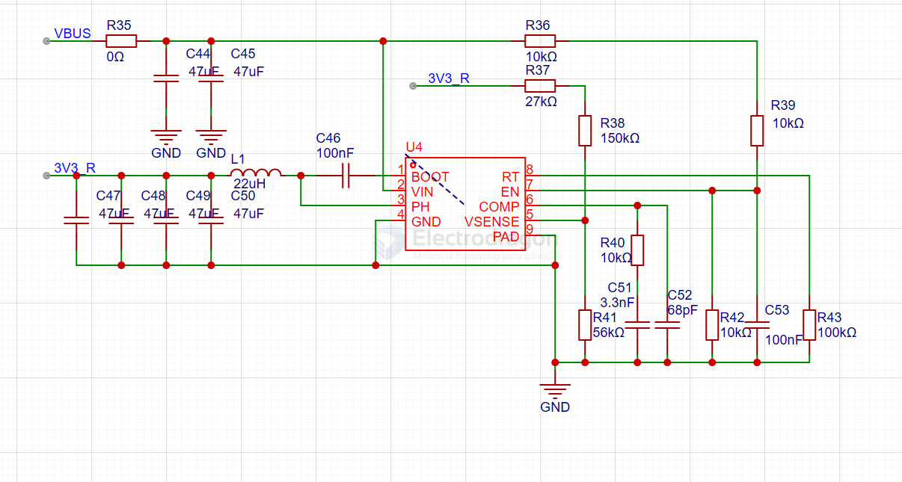

# TI-power-dcdc-down-dat

- [[ti-power-dat]] - [[TI-power-dcdc-down-dat]] - [[ti-power-dcdc-boost-dat]] - [[ti-power-dcdc-boost-down-dat]] - [[TI-LDO-dat]] - [[ti-battery-charger-dat]]

- [[ti-power-dat]] - [[TI-power-dcdc-down-dat]] - [[ti-battery-charger-dat]] - [[ti-power-dcdc-boost-dat]] 

- [[power-dat]] - [[battery-dat]]

- [[dcdc-down-dat]] - [[TI-power-dcdc-down-dat]] - [[TPS56320x-dat]]

- [[TLV62569-dat]] - [[TLV62568-dat]] - [[TI-power-dcdc-down-dat]]

- [[TPS6282x-dat]]

## options 

- [[ti-power-dcdc-down-dat]] - [[LM2596-dat]] - [[LM2576-dat]]

- [[LM2576-dat]] == LM2576xx Series SIMPLE SWITCHER® Power Converter 3-A Step-Down Voltage Regulator

`TPS6211x` 17-V, 1.5-A, Synchronous Step-Down Converter - `TPS62110`, TPS62111, TPS62112, TPS62113

`TPS62933DRLR` SOT-5X3-8 3.8V至30V、3A 低IQ 同步降压转换器

贴片 `TPS61088RHLR` QFN-20 10A 同步升压转换器芯片

`TPS56637RPAR` VQFN-10具有ULQ-Mode的4.5V至28V 6A降压转换器

- [[TPS54560-dat]] 30V 5V

- [[TPS62088-dat]]

- [[TPS5450-dat]]

- [[TPS54302-dat]] == TPS54302 4.5-V to 28-V Input, 3-A Output, EMI-Friendly Synchronous Step-Down Converter

**TPS54202** 4.5-V to 28-V Input, 2-A Output, EMI Friendly Synchronous Step Down Converter

DCDC降压芯片用Ti的TPS54335A，支持4.5V-28V宽电压输入。

### LM2853 3-A 550-kHz Synchronous Buck Regulator 

- • Input Voltage Range of 3 V to 5.5 V
- • Factory EEPROM Set Output Voltages From 0.8 V to 3.3 V in 100 mV Increments
- • Maximum Load Current of 3A
- • Voltage Mode Control
- • Internal Type-Three Compensation
- • Switching Frequency of 550 kHz
- • Low Standby Current of 12 µA
- • Internal 40 mΩ MOSFET Switches
- • Standard Voltage Options – 0.8/1.0/1.2/1.5/1.8/2.5/3.0/3.3 Volts
- • Exposed Pad 14-Lead HTSSOP (PWP) Package

## ref 

