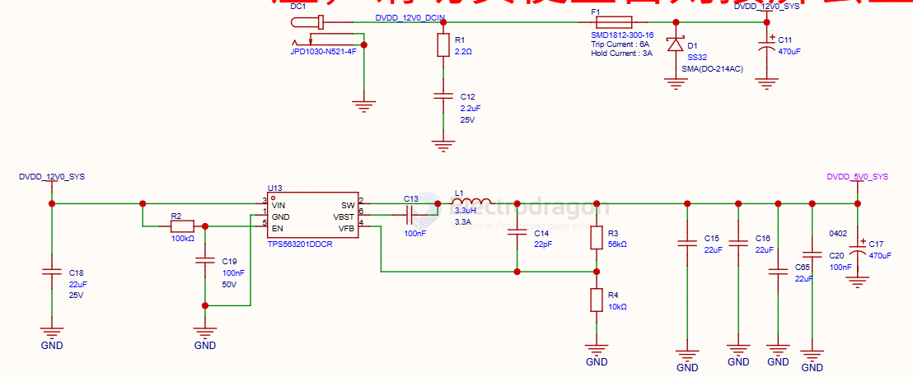
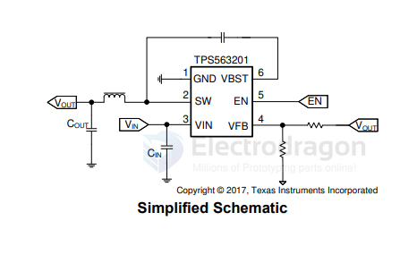

# TPS56320x-dat

- [[dcdc-down-dat]] - [[TI-power-dcdc-down-dat]] - [[TPS56320x-dat]] - [[down-12V-5V-dat]]

https://www.ti.com/lit/ds/symlink/tps563201.pdf?ts=1790229234178

### TPS56320x 4.5V to 17V Input, 3A Synchronous Step-Down Voltage Regulator in SOT-23

The TPS563201 and TPS563208 are simple, easy-to-use, 3A synchronous step-down converters in SOT-23 package.

## build 

## SCH 

## ref 

