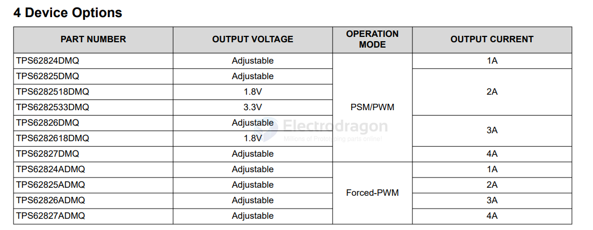
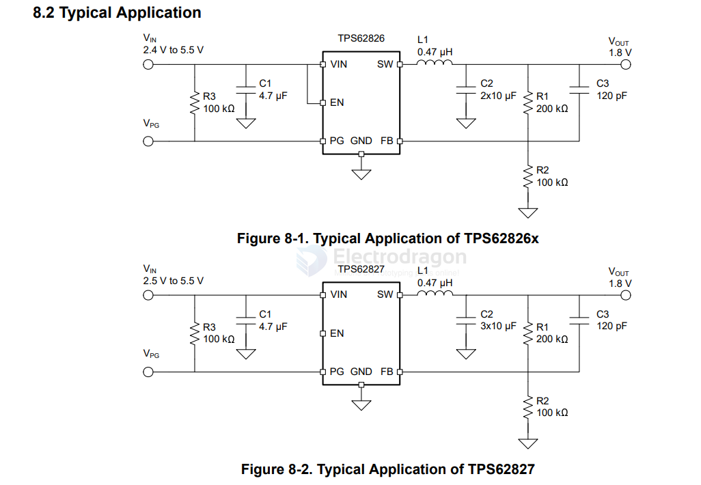
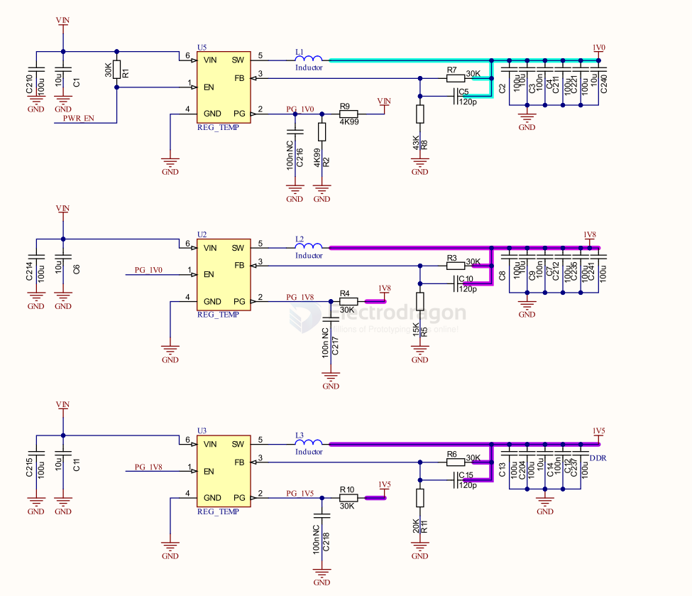
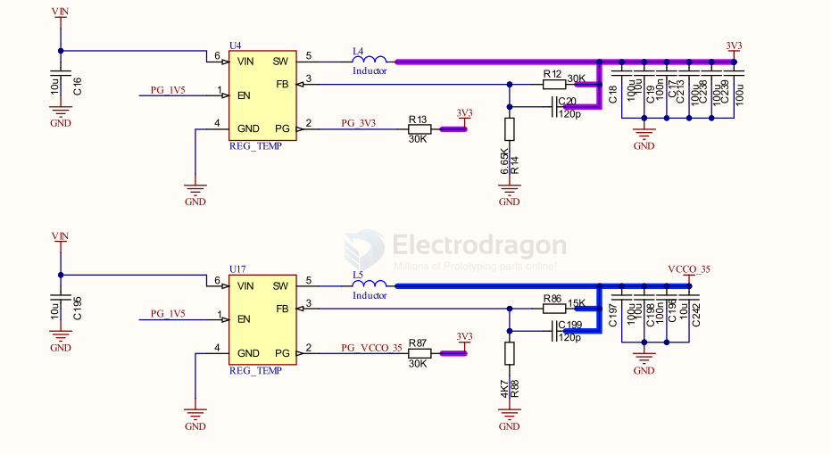
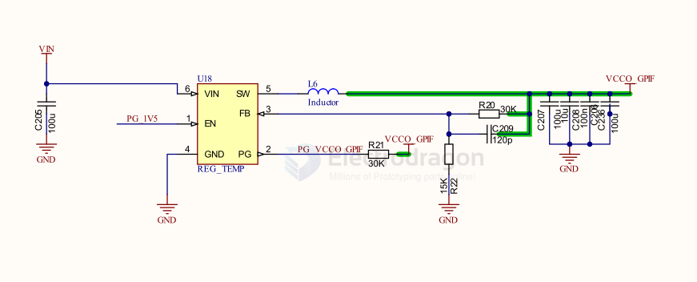

# TPS6282x-dat

- [[ti-power-dat]] - [[TI-power-dcdc-down-dat]] - [[ti-power-dcdc-boost-dat]] - [[ti-power-dcdc-boost-down-dat]] - [[TI-LDO-dat]] - [[ti-battery-charger-dat]]

TPS62824, TPS62825, TPS62826, TPS62827, TPS62824A, TPS62825A, TPS62826A, TPS62827A

TPS6282x 2.4V to 5.5V Input, 1, 2, 3, 4A Step-Down Converter With 1% Output Accuracy

- [[ti-power-dat]] - [[TI-power-dcdc-down-dat]] - [[ti-power-dcdc-boost-dat]] - [[ti-power-dcdc-boost-down-dat]] - [[TI-LDO-dat]] - [[TI-battery-charger-dat]]

## specs 

## SCH 

## build 

V1.0 V1.5 V1.8 

V3.3 V3.5 

## ref 

