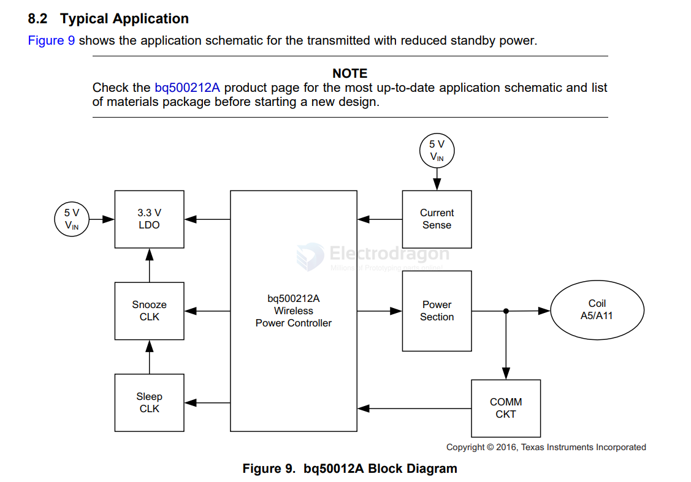
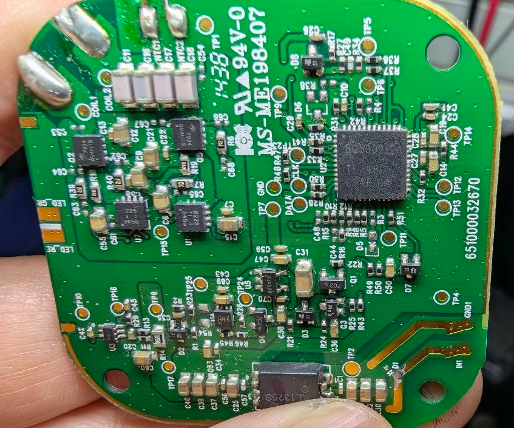

# BQ500212-dat.md

https://www.ti.com/lit/ds/symlink/bq500212a.pdf

bq500212A Low System Cost, Wireless Power Controller for WPC TX A5 or A11

`BQ500212A` == Qi Compliant 5V Wireless Power Transmitter Manager

- [[power-wireless-protocols-dat]] - [[QI-dat]]

- [[coil-dat]] A5? A11? WPC type coil 

## SCH 

## build 

- [[power-wireless-TX-dat]] - [[TPS40200-dat]] - [[TPS28225-dat]] - [[TI-mosfet-driver-dat]] - [[mosfet-dat]] - [[mosfet-driver-dat]] - [[BQ500212-dat]] 

AON7934 - [[mosfet-dat]]

## ref 