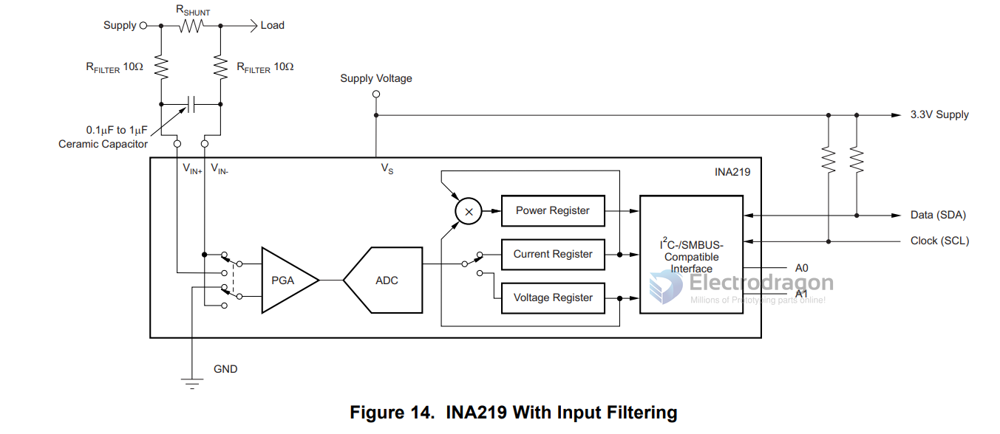

# INA219 

## Info 1

INA219 is a high-side voltage and current sensor that communicates over I2C. It can measure voltage up to 26V and current up to 3.2A with a resolution of 0.8mV and 0.1mA respectively. It is commonly used in battery monitoring, power management, and current sensing applications.

The INA219 senses across shunts on buses that can vary from 0 to 26 V. The device uses a single 3- to 5.5-V supply, drawing a maximum of 1 mA of supply current

## Info 2 

The INA219 chip is a zero-drift, bidirectional current/power monitoring integrated circuit (IC) with an I2C interface, adding to TI's portfolio of energy-saving electronics products. 

With the industry's highest accuracy and smallest size, the INA219 not only monitors the voltage drop across the shunt resistor, senses the shunt supply voltage, but also calculates the power supply. 

The device is available in an SOT23 package and provides a small, low-cost solution for digital current sensing in servers, laptops, power supplies, battery management, and automotive and telecommunications equipment.

The INA219 achieves a maximum error accuracy of 100 µV over the -40C to +85C temperature range with a maximum offset of 100 uV. The product's high precision combined with the advantage of 12-bit resolution can help customers minimize the voltage drop across the shunt resistor, thereby minimizing power loss and consumption and saving board space. The device can sense bus voltages from 0 V to +26 V.
 
Other important features of the INA219 include:
 
- Programmable calibration registers can directly read current in amps and power in watts.
- Up to 128 samples can be averaged to enable filtering in noisy environments.
- The I2C interface has a timeout setting to avoid bus lockup and also provides a high-speed mode for communications up to 3.4 MHz.
- All features of the INA219 are software programmable.
- Operated from a single power supply, its operating voltage ranges from +3.0 to +5.5V.

## Here are some useful links for INA219:

- Datasheet: https://www.ti.com/lit/ds/symlink/ina219.pdf
- Adafruit INA219 tutorial: https://learn.adafruit.com/adafruit-ina219-current-sensor-breakout
- Sparkfun INA219 hookup guide: https://learn.sparkfun.com/tutorials/ina219-current-sensor-hookup-guide
- Arduino library for INA219: https://github.com/adafruit/Adafruit_INA219

## SCH 

## Code and Wiring for arduino

- arduino INA219 library - read voltage and current: [[INA219_library.zip]]

| Arduino UNO | Target - LED | INA219 |
| ----------- | ------------ | ------ |
| 5V          | x            | VCC    |
| GND         | x            | GND    |
| GND         | LED -        | x      |
| 3.3V        | x            | VIN+   |
| x           | LED+         | VIN-   |

Test result is:

    Bus Voltage:   1.81 V
    Shunt Voltage: 0.19 mV
    Load Voltage:  1.81 V
    Current:       1.90 mA

## ref 

- CN datasheet - [[INA219.pdf]]

- [[shunt-resistor-dat]] - [[power-meter-dat/power-sensor-dat]] - [[INA226-dat]]