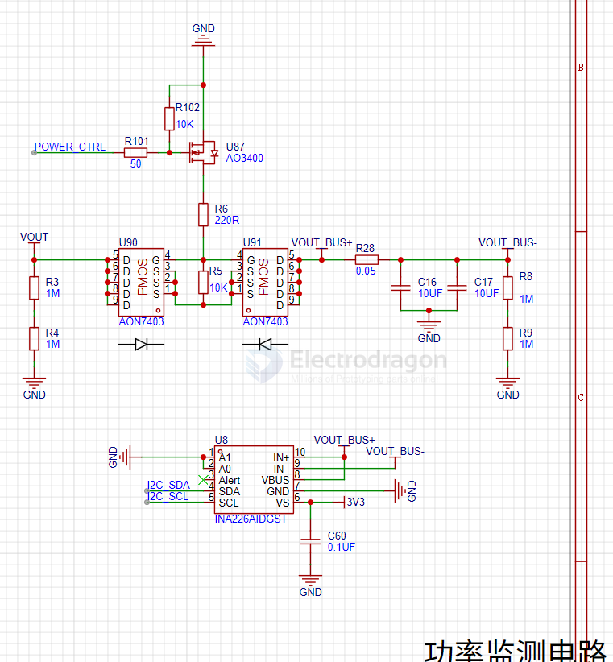

# INA226-dat 

https://www.ti.com/product/INA226

INA226 is a high-side current and power monitor IC (integrated circuit) developed by Texas Instruments. It is designed to accurately measure current, voltage, and power in various applications. The INA226 offers high accuracy, low offset voltage, and a wide common-mode voltage range, making it suitable for a range of precision current sensing applications.

## Here are a few links where you can find more information about INA226:

Texas Instruments official product page: https://www.ti.com/product/INA226

Datasheet for INA226: https://www.ti.com/lit/ds/symlink/ina226.pdf

INA226 Arduino Library and Example Code on GitHub: https://github.com/SV-Zanshin/INA226

INA226 Breakout Board on Adafruit: https://www.adafruit.com/product/904

Please note that providing code for INA226 without any specific requirements would not be meaningful. However, you can find code examples and libraries in the links provided above, which can help you get started with using INA226 in your projects.

## Typical Application 

功率监测芯片采用的是INA226，最大支持20v的电压测量，我这里使用的采样电阻为0.05欧姆，改变采样电阻会改变采样电流分辨率，同时需要修改电流计算部分的代码。

## SCH 2 

- [[AON7403-dat]]

## ref 

- [[power-meter-dat/power-sensor-dat]]