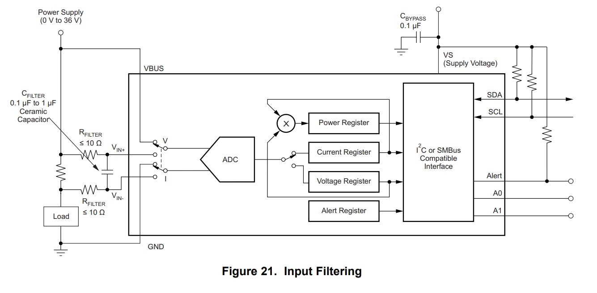
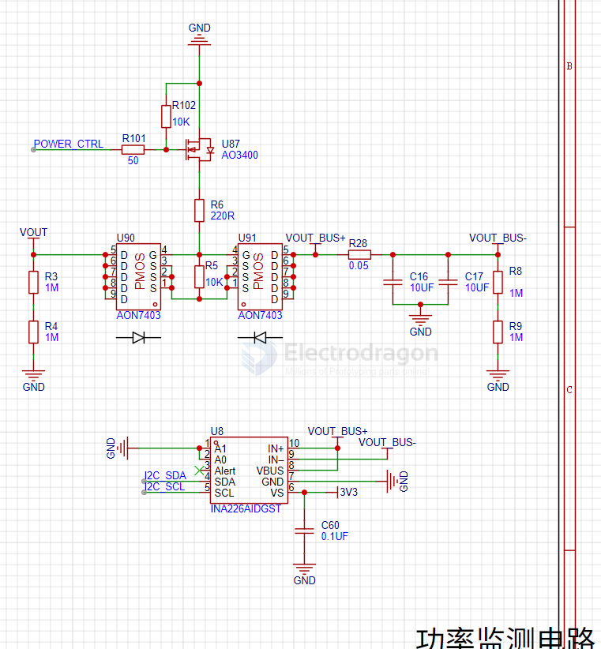

# INA226-dat 

https://www.ti.com/product/INA226

INA226 is a high-side current and power monitor IC (integrated circuit) developed by Texas Instruments. It is designed to accurately measure current, voltage, and power in various applications. The INA226 offers high accuracy, low offset voltage, and a wide common-mode voltage range, making it suitable for a range of precision current sensing applications.

## Here are a few links where you can find more information about INA226:

Texas Instruments official product page: https://www.ti.com/product/INA226

Datasheet for INA226: https://www.ti.com/lit/ds/symlink/ina226.pdf

INA226 Arduino Library and Example Code on GitHub: https://github.com/SV-Zanshin/INA226

INA226 Breakout Board on Adafruit: https://www.adafruit.com/product/904

Please note that providing code for INA226 without any specific requirements would not be meaningful. However, you can find code examples and libraries in the links provided above, which can help you get started with using INA226 in your projects.

## Typical Application 

功率监测芯片采用的是INA226，最大支持20v的电压测量，我这里使用的采样电阻为0.05欧姆，改变采样电阻会改变采样电流分辨率，同时需要修改电流计算部分的代码。

## SCH 2 

- [[AON7403-dat]]

## board 1 

【2】典型接线方法

I2C 通信：SCL/SDA 接单片机对应 I2C 引脚，VCC/GND 接系统电源。

电流测量：将模块串联在被测电路中，电流从IN+流入、IN-流出，经过板载 0.1Ω 采样电阻。

电压测量：VBS接被测电源的正端，模块地与被测电路共地。

【3】工作原理

INA226 采用分流采样 + ADC 转换的方式实现测量：
电流测量：电流流过板载 0.1Ω 采样电阻，产生微小电压降，芯片通过差分放大器放大后送入 16 位 ADC，计算出电流值。

电压测量：直接对总线电压（VBS 引脚）进行分压采样和 ADC 转换。

功率计算：芯片内部将测得的电压和电流相乘，直接输出功率值，无需额外计算。

双向测量：支持正 / 负电流测量，可用于电源和负载双向场景。

## ref 

- [[power-sensor-dat]]