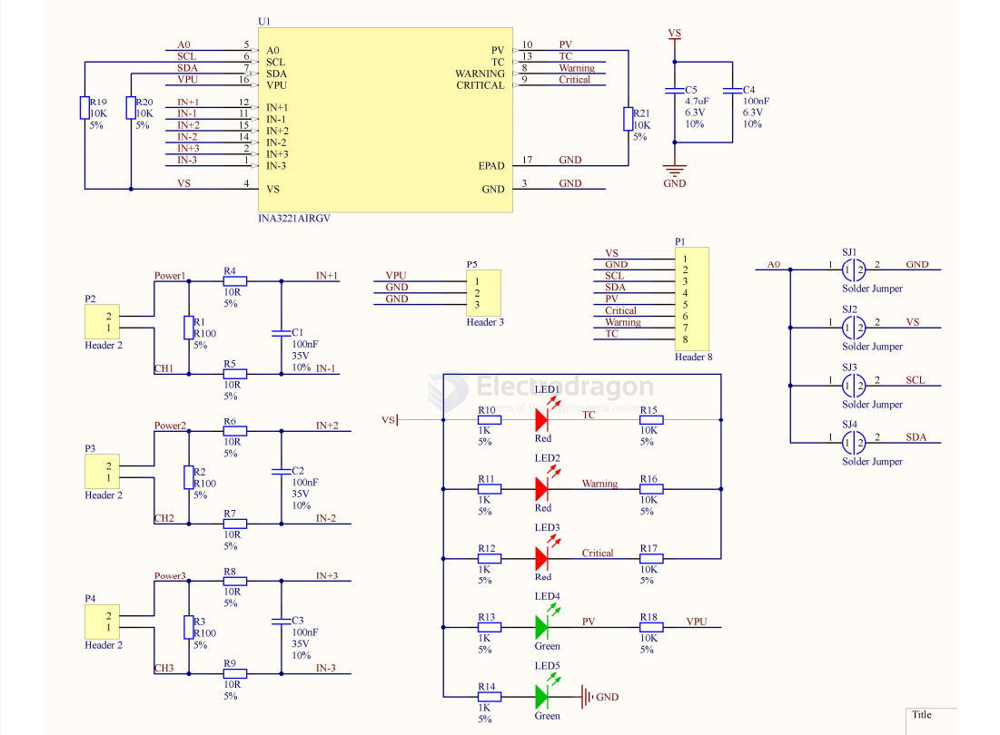

# INA3221-dat

- [[INA226-dat]] - [[INA3221-dat]] - [[TI-sensor-dat]]

INA3221 是一款三通道、 高侧电流和总线电压监视器， 具有一个兼容 I2C 和 SMBUS 的接口。 INA3221不仅能够监视分流压降和总线电源电压， 还针对这些信号提供有可编程的转换时间和平均值计算模式。INA3221 提供关键报警和警告报警， 用于检测每条通道上可编程的多种超范围情况。

INA3221 感测总线（电压在 0V 至 +26V 范围内变化）上的电流。 此器件由 2.7V 至 5.5V 单电源供电， 电源电流消耗为 350μA（典型值） 。 INA3221 的额定运行温度范围为 -40°C 至 +125°C。 兼容 I2C 和 SMBUS 的接口 具有 四个可编程地址。 

## SCH 

## ref 