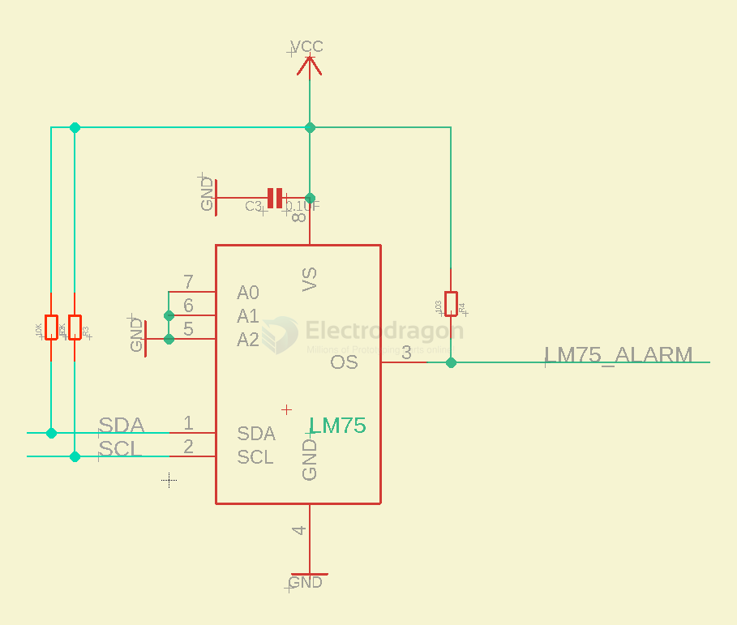

# LM75-dat

https://www.analog.com/media/en/technical-documentation/data-sheets/lm75.pdf

## 🔧 Output Pin: OS (Overtemperature Shutdown)

- The **OS pin** is the alarm output.
- It indicates when the temperature crosses a programmed **threshold**.
- Can be used to **trigger a fan, shut down a system, or raise an alert**.

---

## ⚙️ Output Behavior

The output is **open-drain**, meaning:

- It can **only pull low** (to GND)
- You need an **external pull-up resistor** to make it go high

So in practice:

| State             | OS Output (with pull-up) |
|------------------|--------------------------|
| No alarm         | **High** (pulled up)     |
| Over-temp alarm  | **Low** (active)         |

## demo code 

https://github.com/Edragon/RPI

- [[RPI-dat]]

- [[py-LM75-dat.py]]

## ref 

- [[LM75]]