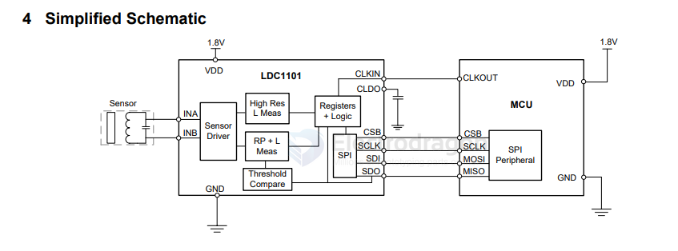

# ti-sensor-dat.md

[[dc-current-sensor-dat]] 

- [[INA330-dat]]

- [[INA219-dat]] 
- [[INA226-dat]] 
- [[INA240-dat]] 
- [[INA231-dat]]

[[sensor-temperature-dat]] - [[LM75-dat]]

- INA240 –4-V to 80-V, Bidirectional, Ultra-Precise Current Sense Amplifier With Enhanced PWM Rejection

INA332 / INA2332 - Low-Power, Single-Supply, CMOS INSTRUMENTATION AMPLIFIERS

LM35 - LM35 Precision Centigrade Temperature Sensors

## LDC 

- [[TI-sensor-dat]] - [[LDC-dat]] - [[LDC1101-dat]]

LDC1101DRCR / VS0N-10 - 用于高速应用的单通道、1.8V、24位电感、16位谐振器电阻、电感数字转换器芯片

LDC1101 1.8-V High-Resolution, High-Speed Inductance-to-Digital Converter

## ref 

