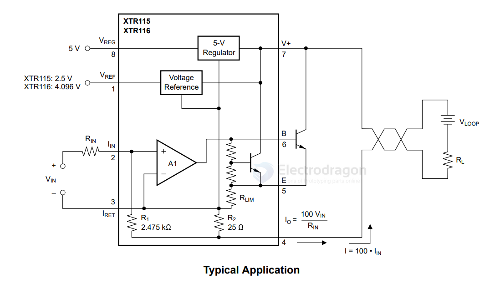

# XTR115-dat

current in pin 2 

current out pin 4~7

The XTR115 and XTR116 (XTR11x) are precision current output converters designed to transmit analog 4-mA-to-20-mA signals over an industry standard current loop. These devices provide accurate current scaling and output current limit functions.

## ref 

- [[XTR115]]

- [[TI-dat]]