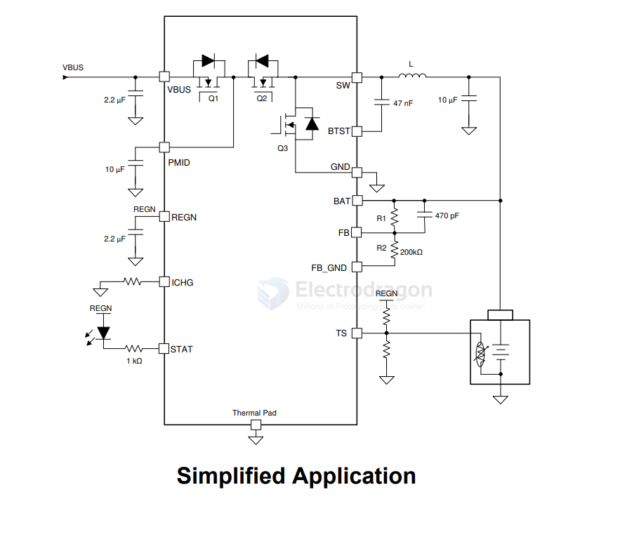
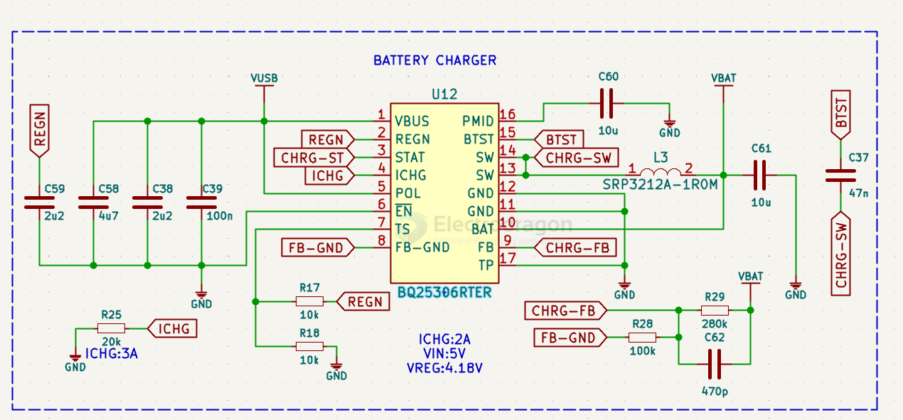

# BQ25306-dat

- [[BQ25306-dat]] - [[ti-battery-charger-dat]]

BQ25306RTER

BQ25306 Standalone 17-V, 3.0-A 1-2 Cell Buck Battery Charger

The BQ25306 is a highly-integrated standalone switch-mode battery charger for 1-cell and 2-cell Liion, Li-polymer, and LiFePO4 batteries. 

The BQ25306 supports 4.1-V to 17-V input voltage and 3-A fast charge current.

The integrated current sensing topology of the device enables high charge efficiency and low BOM cost. 

The best-in-class 200-nA low quiescent current of the device conserves battery energy and maximizes the shelf time for portable devices. 

The BQ25306 is available in a 3x3 WQFN package for easy 2-layer layout and space limited applications.

## SCH 

## build 

## ref 

