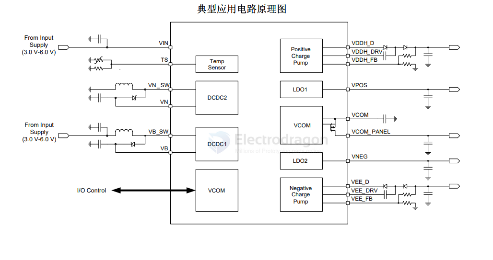
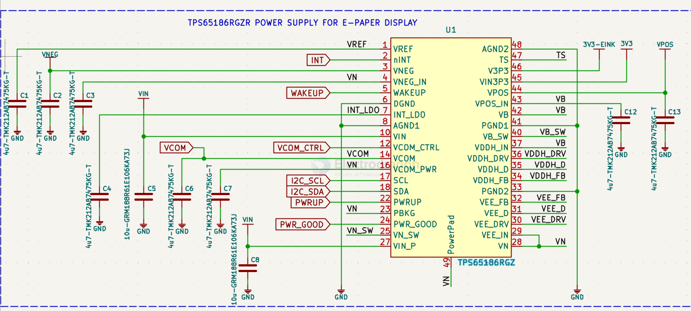
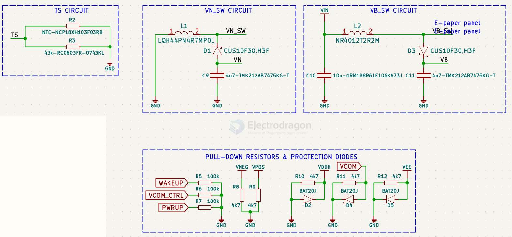

# ti-power-app-dat

- [[TPS65186-dat]] - [[TI-power-app-dat]] - [[ti-power-dat]] - [[epaper-dat]]

TPS65186 面向 E Ink® Vizplex™电子纸显示屏的 PMIC

TPS65186 器件是一款单芯片电源，专为为便携式电子阅读器 应用中的 E Ink Vizplex 显示屏而设计。此器件支持 9.7 英寸及以上的显示屏尺寸。两个高效 DCDC 升压转换器生成 ±16V 电压轨。

这两个电压轨通过两个电荷泵分别升压至 22V 和 –20V，从而为 Vizplex显示屏提供栅极驱动电源。两个跟踪 LDO 生成 ±15V源级驱动电源，最高支持 120mA 的输出电流。所有电压轨均可通过 I2C 接口进行调节，从而适应特定的显示屏要求。

## SCH 

## build 

## ref 

