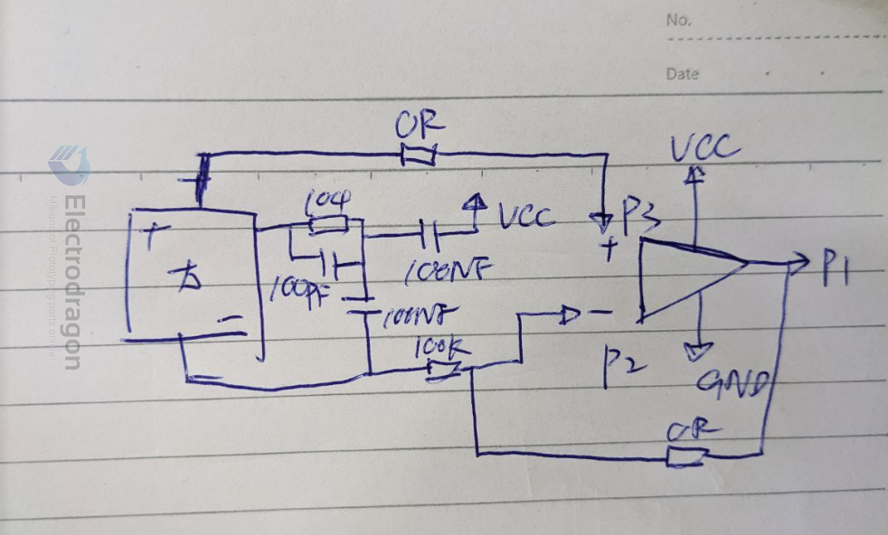

# LM358 DAT 

https://www.ti.com/lit/ds/snosbt3j/snosbt3j.pdf?ts=1688712730211&ref_url=https%253A%252F%252Fwww.google.com%252F

## App

- solar detector
- solar voltage at 2.6-2.8V, output 3.5V 

## ref 

[[LM358]]
